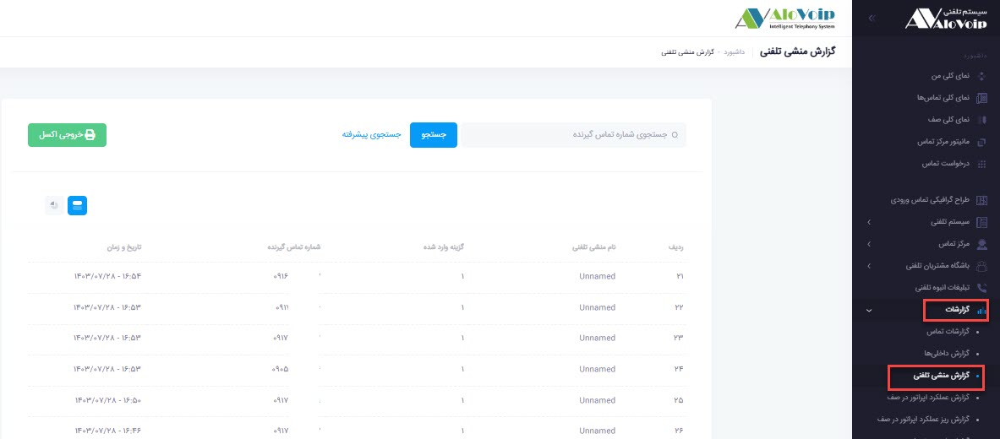
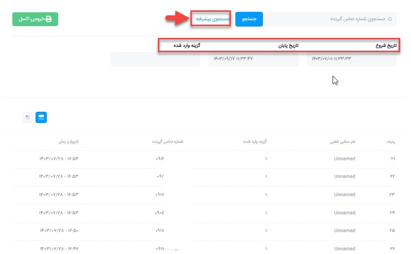
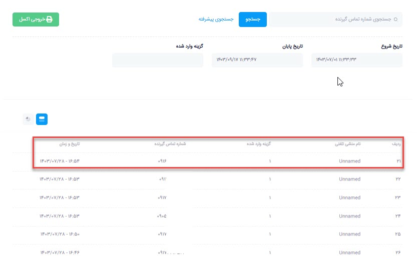

# گزارش منشی تلفنی

در این بخش به موضوعات زیر می‌پردازیم:
-	[هدف از گزارش منشی تلفنی](#PurposeOfTheIVRReport)
-	[تحلیل گزارش منشی تلفنی](#AnalyzingTheIVRReport)
## هدف از گزارش منشی تلفنی{#PurposeOfTheIVRReport}
گزارش منشی تلفنی با هدف ارائه‌ی آماری دقیق از عملکرد منشی تلفنی سازمان طراحی شده است. از طریق این گزارش می‌توان دریافت که بیشترین تماس‌ها و انتخاب‌های انجام‌شده بر روی چه شماره‌ها یا گزینه‌هایی متمرکز بوده‌اند. این اطلاعات به مدیران کمک می‌کند تا دیدی روشن‌تر نسبت به الگوی تماس‌های مشتریان و نیازهای آنان کسب کنند

## تحلیل گزارش منشی تلفنی{#AnalyzingTheIVRReport}
برای مشاهده‌ی جزئیات این گزارش، از بخش **گزارشات > گزارش منشی تلفنی** اقدام نمایید. در صفحه‌ی مربوطه، فهرستی از تماس‌ها به‌همراه عدد انتخابی توسط مشتریان نمایش داده می‌شود.

در صورت نیاز به جستجوی دقیق‌تر، بر روی گزینه‌ی **جستجوی پیشرفته** کلیک کنید. سپس **تاریخ شروع** و **تاریخ** **پایان** موردنظر خود را وارد نمایید. همچنین با مشخص کردن **گزینه‌ی** **وارد** شده می‌توانید صرفاً آماری از تماس‌هایی مشاهده کنید که عدد خاصی را روی **منشی تلفنی** وارد کرده‌اند.

پس از تنظیم معیارهای جستجو، با فشردن دکمه‌ی **جستجو**، گزارش مربوطه در قالب جدولی نمایش داده خواهد شد؛ جدولی شامل شماره تماس‌ها، زمان و تاریخ تماس، و عدد انتخاب‌شده توسط تماس‌گیرنده.

در نهایت، امکان دریافت **خروجی** **اکسل** از این گزارش نیز فراهم است تا بتوان اطلاعات را برای تحلیل‌های آماری و مدیریتی دقیق‌تر ذخیره و مورد بررسی قرار داد

