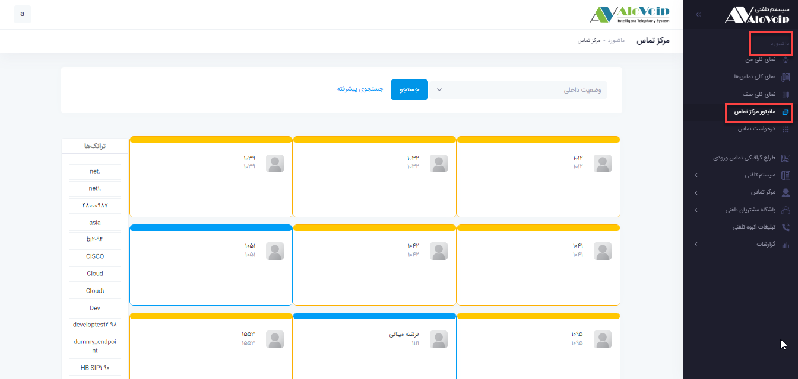
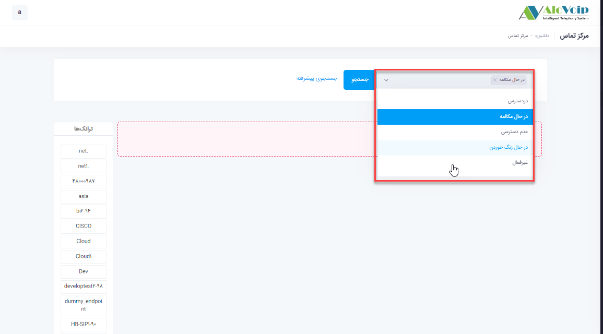
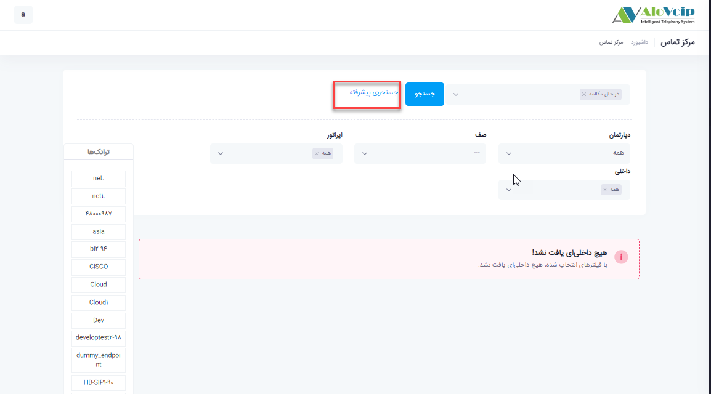
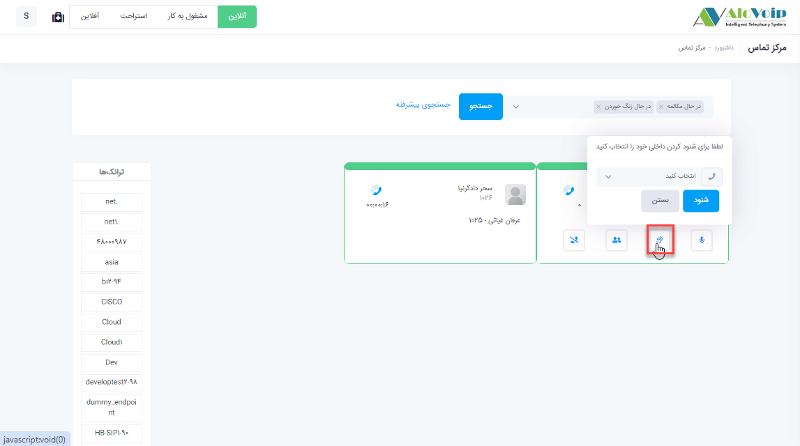
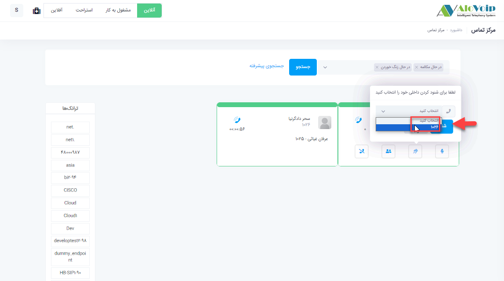
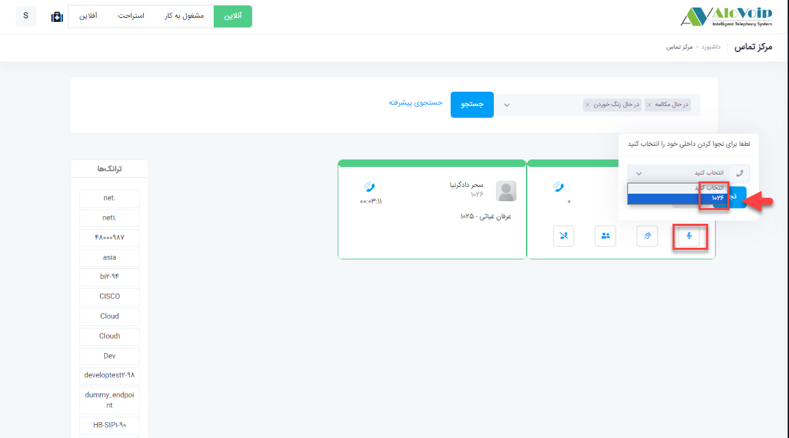
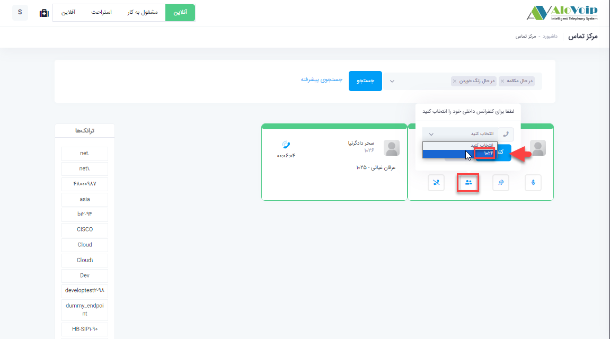
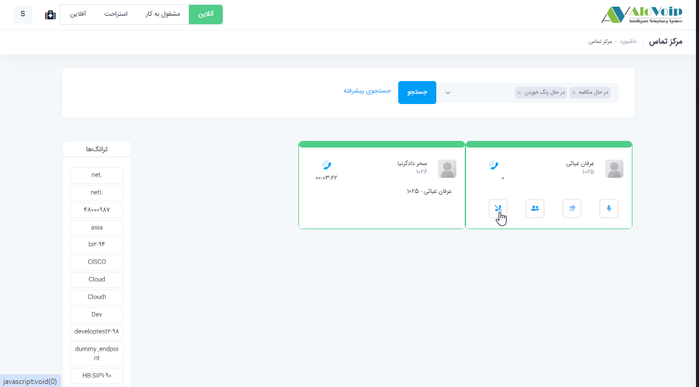

# مانیتورینگ مرکز تماس

در این بخش به موضوعات زیر می‌پردازیم: 
- [مقدمه ](#Introduction)
- [مانیتورینگ مرکز تماس ](#CallCenterMonitoring)
- [شنود ](#listening)
- [نجوا ](#Whisper)
- [کنفرانس ](#Conference)
- [قطع تماس](#CallCancellation)

## مقدمه{#Introduction}
در بخش مانیتورینگ مرکز تماس تمام داخلی های سازمان را می‌توانید مشاهده کنید و از وضعیت آنها که چه داخلی هایی آزاد و یا در حال مکالمه هستند مطلع شوید.همچنین این امکان برای مدیران دپارتمان ها فراهم می‌شود که بتوانند داخلی های مربوط به دپارتمان خود را شنود، نجوا کنند، کنفرانس و یاحتی قطع  تماس کنند.

##  مانیتورینگ مرکز تماس{#CallCenterMonitoring}
در پنل الوویپ از قسمت داشبورد روی مانیتورینگ مرکز تماس  که کلیک کنید. بصورت پیش فرض دو فیلتر در حال مکالمه و در حال زنگ خوردن وجود دارد که با برداشتن فیلترها ی پیش فرض می‌توانید تمام داخلی ها را در این بخش ببینید.طبق عکس زیر داخلی هایی که با رنگ نارنجی نمایش داده شده نشان دهنده عدم رجیستری آن داخلی می‌باشد.رنگ آبی نشان دهنده رجیستر بودن آن داخلی است و رنگ سبز داخلی درحال مکالمه را نمایش می‌دهد. 

بصورت پیش فرض 2 فیلتر وجود دارد: داخلی های در حال مکالمه و در حال زنگ خوردن. اگر به این فیلترها نیاز نداشته باشید به راحتی روی علامت ضربدر بزنید و فیلترهای دیگری را انتخاب کنید. و یا در جستجوی پیشرفته بر اساس فیلدهایی که وجود دارد فیلتر مورد نظر را انتخاب و جستجو کنید.همچنین در قسمت چپ تصویر ‌می‌توانید تشخیص دهید که تماس های شما بر روی  کدام ترانک برقرار است.

## شنود{#listening}
با قرار دادن نشانگر موس بر روی داخلی در حال مکالمه گزینه های شنود ، نجوا، کنفرانس و قطع تماس برای مدیر دپارتمان فراهم می‌شود.برای این کار به عنوان مثال کافی است روی علامت شنود کلیک کرده و از پنجره باز شده داخلی خود را انتخاب  و روی گزینه شنود کلیک کنید.در این حالت یک تماس به سمت داخلی انتخاب شده می‌رود، داخلی زنگ می‌خورد و با برداشتن گوشی روی خط اپراتور می‌روید و امکان شنیدن مکالمات کارشناس خود را با تماس گیرنده دارید و هیچکدام از طرفین متوجه این شنود نمی‌شوند.

## نجوا{#Whisper}
در حالت نجوا شما می توانید با کار شناس خود صحبت کنید.مانند حالت شنود روی دکمه نجوا کلیک کرده و داخلی خود را انتخاب و مجدد نجوا را می‌زنید

## کنفرانس{#Conference}
در حالت کنفرانس هم با انتخاب دکمه کنفرانس و انتخاب داخلی خود و زدن کنفرانس شما به عنوان نفر سوم به جمع دونفره قبلی اضافه می‌شوید و امکان صحبت با هر دو نفر وجود دارد.

## قطع تماس{#CallCancellation}
همچنین با زدن دکمه قطع تماس امکان قطع تماس اپراتور وجود دارد.
