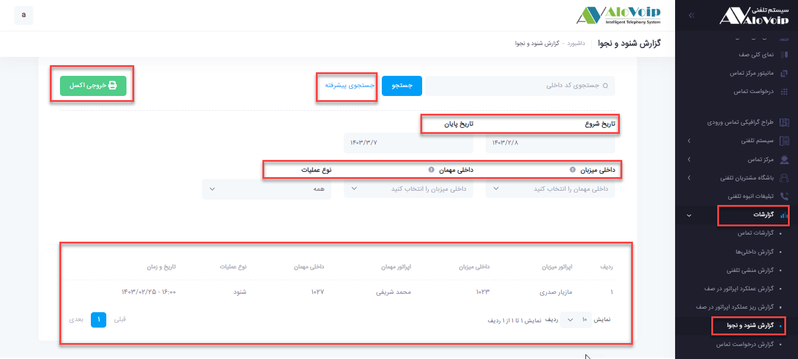

# گزارش شنود و نجوا

در این بخش به موضوعات زیر می‌پردازیم:

•	[هدف از گزارش شنود و نجوا ](#PurposeOfEavesdroppingReport)

•	[مشاهده گزارش شنود و نجوا](#ViewTheListeningAndWhisperingReport)

## (هدف از گزارش شنود و نجوا ){#PurposeOfEavesdroppingReport}

با این گزارش این امکان فراهم می‌شود که متوجه شوید  چه داخلی هایی، داخلی ها ی دیگر را شنود یا نجوا کرده اند.

## (مشاهده گزارش شنود و نجوا){#ViewTheListeningAndWhisperingReport}

در پنل الوویپ از قسمت **گزارشات > گزارش شنود و نجوا** را انتخاب کنید.در صفحه باز شده کل گزارشات شنود و نجوای سازمان خود را می‌توانید مشاهده کنید. در قسمت **جستجوی پیشرفته** بر اساس تاریخ، داخلی میزبان(شخصی که تماس داشته است)، داخلی مهمان(شخصی که شنود و نجوا را برقرار کرده)، و بر اساس نوع عملیات( شنود، نجوا) می‌توانید فیلتر داشته باشید.
در آخر هم می‌توانید یک خروجی اکسل از گزارش خود داشته باشید.

 