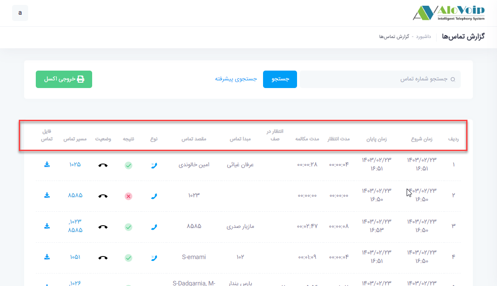

# گزارشات تماس

در این بخش به موضوعات زیر می‌پردازیم:
- [هدف از گزارشات تماس ](PurposeOfCallReports)
- [مشاهده گزارشات تماس](ViewCallLogs)

## (هدف از گزارشات تماس ){PurposeOfCallReports}
در این بخش می‌توانید  تمامی گزارش تماس های مربوط به سازمان از قبیل تماس های ورودی ،خروجی و داخلی هارا مشاهده نمود .

## (مشاهده گزارشات تماس){ViewCallLogs}
برای دیدن گزارشات تماس در پنل الوویپ از قسمت **گزارشات >گزارشات تماس** را باز کنید.

 

در صفحه باز شده می‌توانید بطور کامل وضعیت تماس هایی که در سیستم تلفنی اتفاق افتاده است را ببینید.مانند 
- زمان شروع یک تماس،زمان پایان، مدت انتظار، مدت مکالمه
- انتظار در صف(چقدر در صف منتظر بوده است)
- مبدا تماس و مقصد تماس
- نوع تماس که ورودی یا خروجی بوده است
- نتیجه تماس که موفق و یا ناموفق بوده
- وضعیت تماس(زنده و یا پایان یافته)
- مسیر تماس و حتی  می‌توانید فایل های ضبط شده را هم گوش دهید و دانلود کنید.
- امکان گرفتن خروجی اکسل از این گزارشات نیز وجود دارد.همچنین در انتهای صفحه مجموع زمان مکالمه و زمان انتظار را می‌توانید ببینید که بصورت پیش فرض در بازه سی روزه محاسبه شده اند

 

 
- همچنین برای فیلتر دقیق تر روی گزینه **جستجوی پیشرفته** کلیک کنید که جستجوی خود را بر اساس 
- **وضعیت تماس**(تماس زنده، تماس پایان یافته)
- **نوع تماس**(تماس ورودی، تماس خروجی و تماس داخلی) 
- **نتیجه تماس**(همه،موفق و ناموفق)
- **شماره مبدا تماس** 
- **شماره مقصد تماس** 
- در کنار این دو فیلد شماره مبدا تماس و شماره مقصد تماس گزینه های *شامل،مساوی،شروع با و پایان با* وجود دارد که مثلا اگر شما دنبال شماره ایی می‌گردید که عدد 501 در آن وجود دارد **شامل** را انتخاب کنید و اگر دقیقا خود شماره 501 است **مساوی** را انتخاب و اگر شماره با 501 شروع می‌شود **شروع با** انتخاب و اگر با 501 تمام می‌شود **پایان با** را  می‌توانید انتخاب کنید.
- همچنین بر اساس **پست صوتی ، پاسخ به گروه تماس ، تماس تبلیغاتی ،صف ، داخلی ، ترانک ،دپارتمان، مدت تماس، مدت انتظار و تاریخ مدنظر** می‌توانید  فیلتر کنید.

 
