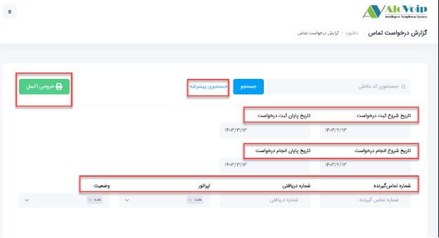

# گزارش درخواست تماس

در این بخش به موضوعات زیر می‌پردازیم:
- [هدف از گزارش درخواست تماس ](#PurposeOfCallRequestReport)
- [مشاهده گزارش درخواست تماس](#ViewCallRequestReport)

## هدف از گزارش درخواست تماس{#PurposeOfCallRequestReport}
در گزارش درخواست تماس مشاهده می‌کنید چه شماره هایی برای چه داخلی هایی درخواست تماس ثبت کرده اند تا اقدامات لازم برای ارتباط با آن شماره ها انجام شود. 

## مشاهده گزارش درخواست تماس{#ViewCallRequestReport}
برای مشاهده این گزارش در پنل الوویپ از قسمت \*\***گزارشات > گزارش درخواست تماس\*\*** را انتخاب کنید.
- همانطور که مشاهده می‌کنید برای اپراتور مازیار صدری با داخلی 1023 شماره 02143000049 یک درخواست تماس ثبت کرده است.
- شماره دریافتی، شماره ایی است که تماس گیرنده در درخواست تماس خود ثبت  کرده است و کارشناسان شما باید با همین شماره تماس بگیرند.
- در تاریخ 17/02/1403 ساعت 09:56 این درخواست تماس ثبت شده و در تاریخ 1403/02/17 ساعت 16:47 به این درخواست رسیدگی شده است.
- وضعیت موفق هم نشان دهنده همین موضوع است که برای داخلی 1023 یک درخواست تماس ثبت شده است.

- **جستجوی پیشرفته** :  در قسمت جستجوی پیشرفته  بر اساس تاریخ شروع و پایان ثبت درخواست، تاریخ شروع و پایان انجام درخواست، شماره تماس گیرنده، شماره دریافتی، اپراتور و وضعیت تماسی می‌توانید فیلتر را انجام دهید. همچنین از نتیجه می‌توانید یک خروجی اکسل تهیه کنید.

