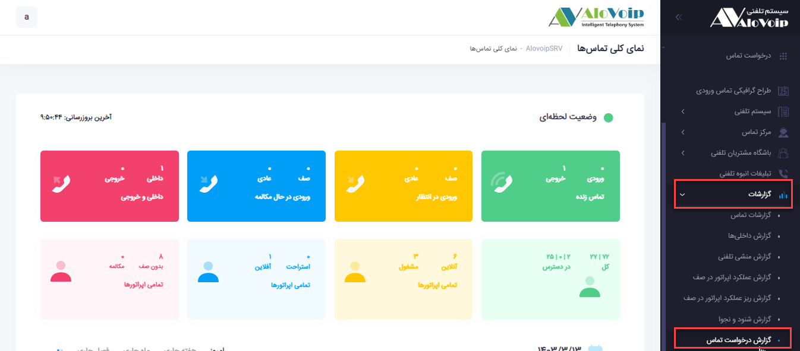
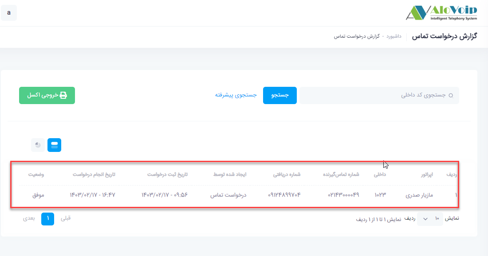
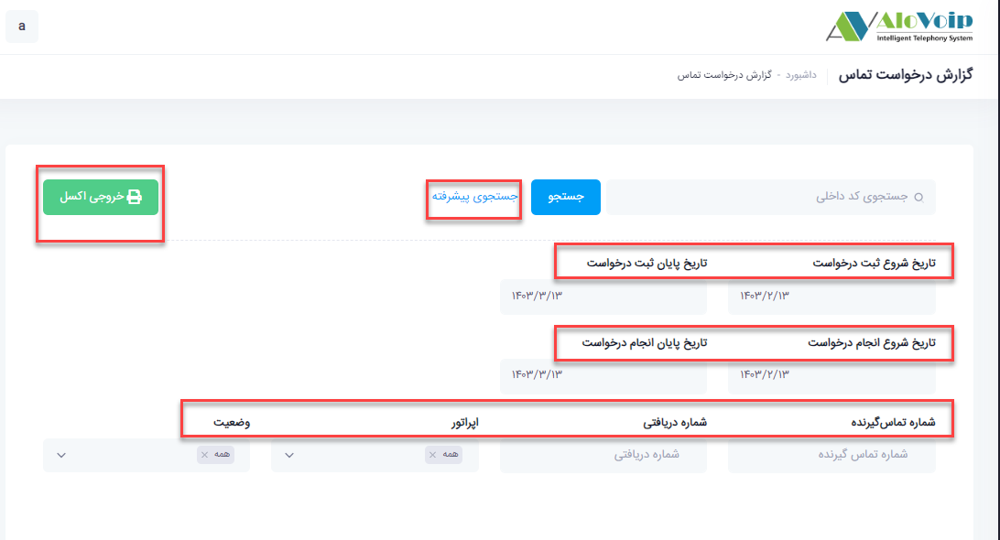

# گزارش درخواست تماس

در این بخش به موضوعات زیر می‌پردازیم:

•	[هدف از گزارش درخواست تماس ](#PurposeOfCallRequestReport)

•	[مشاهده گزارش درخواست تماس](#ViewCallRequestReport)

## (هدف از گزارش درخواست تماس ){#PurposeOfCallRequestReport}

در گزارش درخواست تماس مشاهده می‌کنید چه شماره هایی برای چه داخلی هایی درخواست تماس ثبت کرده اند تا اقدامات لازم برای ارتباط با آن شماره ها انجام شود.

## (مشاهده گزارش درخواست تماس){#ViewCallRequestReport}

در پنل الوویپ از قسمت **گزارشات > گزارش درخواست تماس** را انتخاب کنید.همانطور که مشاهده می‌کنید برای اپراتور مازیار صدری با داخلی 1023 شماره 02143000049 یک درخواست تماس در تاریخ 17/02/1403 ثبت کرده است.

 

 

در قسمت **جستجوی پیشرفته** بر اساس تاریخ شروع و پایان ثبت درخواست، تاریخ شروع و پایان انجام درخواست، شماره تماس گیرنده، شماره دریافتی، اپراتور و وضعیت تماسی می‌توانید فیلتر را انجام دهید. همچنین از نتیجه می‌توانید یک خروجی اکسل تهیه کنید

 
