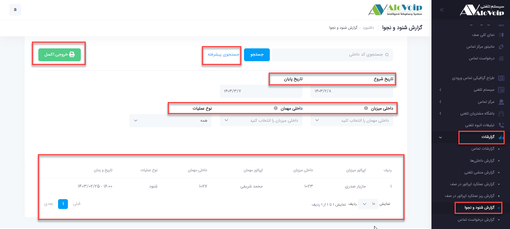

# گزارش شنود و نجوا

در این بخش به موضوعات زیر می‌پردازیم:
- [هدف از گزارش شنود و نجوا ](#PurposeOfEavesdroppingReport)
- [مشاهده گزارش شنود و نجوا](#ViewTheListeningAndWhisperingReport)

## (هدف از گزارش شنود و نجوا ){#PurposeOfEavesdroppingReport}
گزارش شنود و نجوا با هدف ارائه‌ی تصویری شفاف از عملکرد مدیران و کارشناسان سازمان طراحی شده است. از طریق این گزارش می‌توان تشخیص داد که چه داخلی‌هایی اقدام به شنود یا نجوا با سایر داخلی‌ها کرده‌اند. این اطلاعات به مدیران کمک می‌کند تا بر فرآیند نظارت بر مکالمات و کیفیت کنترل تماس‌ها اشراف بیشتری داشته باشند.

## (مشاهده گزارش شنود و نجوا){#ViewTheListeningAndWhisperingReport}
برای دسترسی به این بخش، از طریق پنل **الوویپ** مسیر گزارشات > گزارش شنود و نجوا را انتخاب کنید. در صفحه‌ی نمایش داده‌شده، فهرست کامل گزارش‌های **شنود** و **نجوای** انجام‌شده در سازمان قابل مشاهده است.
با استفاده از گزینه‌ی جستجوی پیشرفته می‌توانید نتایج را بر اساس معیارهای گوناگون فیلتر نمایید؛ از جمله:

- 	تاریخ انجام شنود یا نجوا
-	داخلی میزبان (فردی که تماس اصلی را در اختیار داشته است)
-	داخلی مهمان (فردی که شنود یا نجوا را برقرار کرده است)
-	نوع عملیات (شنود یا نجوا)

پس از تنظیم فیلترها و اجرای جستجو، اطلاعات دقیق مربوط به هر عملیات نمایش داده می‌شود. در پایان نیز امکان دریافت **خروجی** **اکسل** از این گزارش فراهم است تا بتوان داده‌ها را برای تحلیل‌های مدیریتی، آموزشی یا کنترلی ذخیره و بررسی نمود.

 