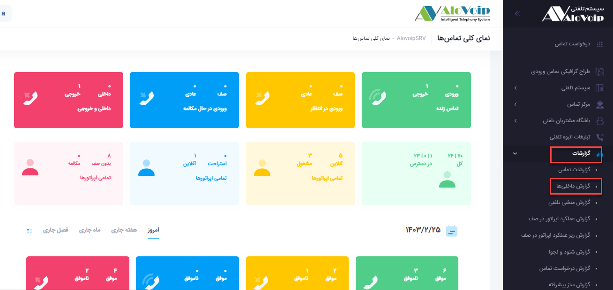
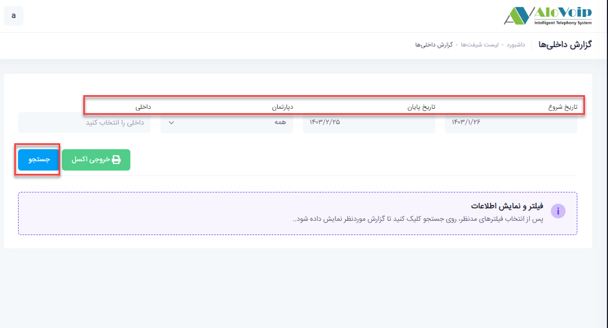
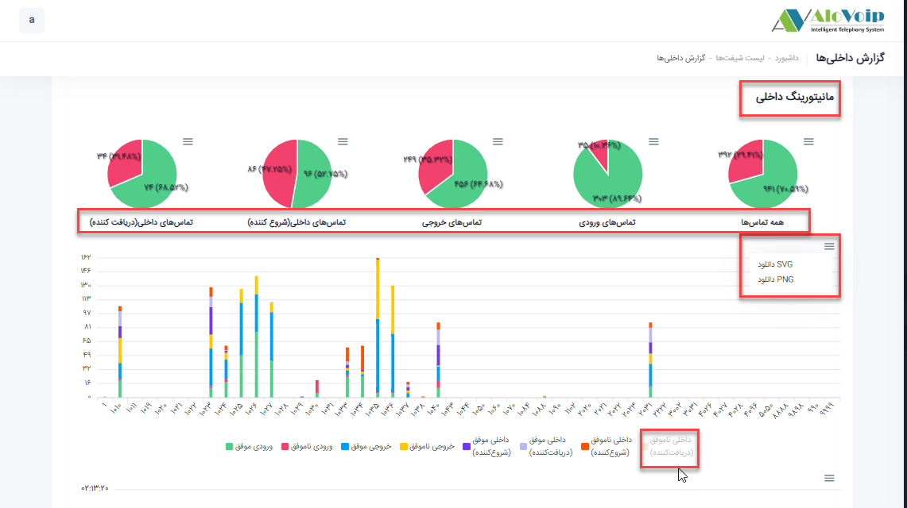
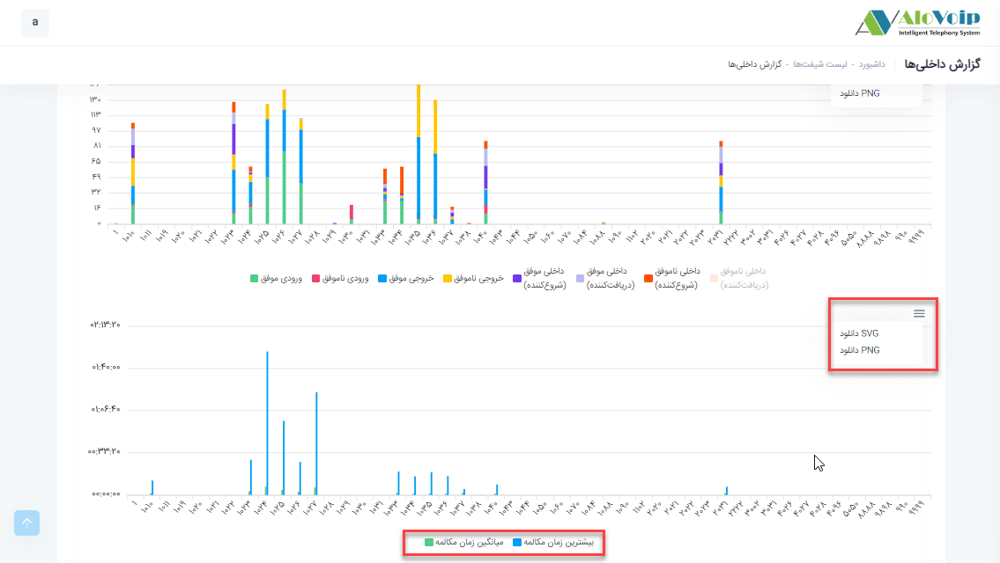
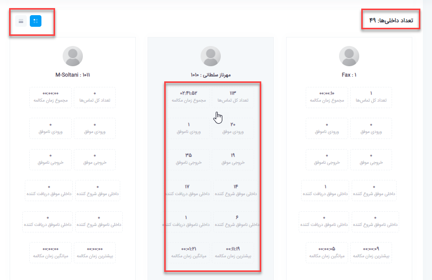

# گزارش داخلی ها

در این بخش به موضوعات زیر می‌پردازیم:
- [هدف از گزارش داخلی ها ](#ThePurposeOfExtensionsReporting)
- [مشاهده گزارشات داخلی ها](#ViewExtentionsReports)

## (هدف از گزارش داخلی ها){#ThePurposeOfExtensionsReporting}
گزارش داخلی ها این کمک را به شما می‌کند که روی یک داخلی خاص اطلاعات مورد نیاز را بدست آورید.به عنوان مثال اطلاعاتی از قبیل تعداد تماس های یک داخلی، مدت زمان مکالمه.

## (مشاهده گزارشات داخلی ها){ViewExtentionsReports}
- از قسمت **گزارشات** وارد **گزارش داخلی ها** شوید و در صفحه باز شده در قسمت **تاریخ شروع و تاریخ پایان** بازه زمانی مورد نظرتان را مشخص می‌کنید و براساس **دپارتمان** و یا **داخلی ها** گزارش خود را فیلتر کنید. در انتها روی **جستجو** کلیک کنید تا نتایج مورد نظر را مشاهده کنید.

- در قسمت **مانیتورینگ داخلی ها** بصورت نمودار دایره ایی و میله ایی اطلاعات مربوط به **تماس های ورودی، تماس های خروجی، تماس های داخلی**(شروع کننده) و **تماس های داخلی**(دریافت کننده) را  می‌توانید ببینید. در قسمت نمودار میله ایی هم می‌توانید بخش هایی که به آن نیاز ندارید را با کلیک بر روی آن  از نمودار حذف کنید.این نمودارها بصورت **SVG**  و یا **PNG** قابل دانلود می‌باشند.

- در نمودار بعدی می‌توانید همین وضعیت تماسی را بر اساس **میانگین زمان مکالمه و بیشترین زمان مکالمه** مشاهده کنید که برای هر داخلی به چه صورت است.

- در قسمت بخش **تعداد داخلی ها** می‌توانید داخلی ها را به دو صورت سطری و کارتی مشاهده کنید و از هر داخلی اطلاعاتی از قبیل تعداد کل تماس ها، مجموع زمان مکالمه، ورودی موفق و ناموفق، خروجی موفق و ناموفق، چند تماس را شروع کننده و چند تماس را دریافت کننده بودید، بیشترین زمان مکالمه و میانگین زمان مکالمه را  بدست آورید و حتی از این داده ها می‌توانید خروجی اکسل هم بگیرید.

- نمایش به صورت کارتی

- نمایش به صورت سطری

