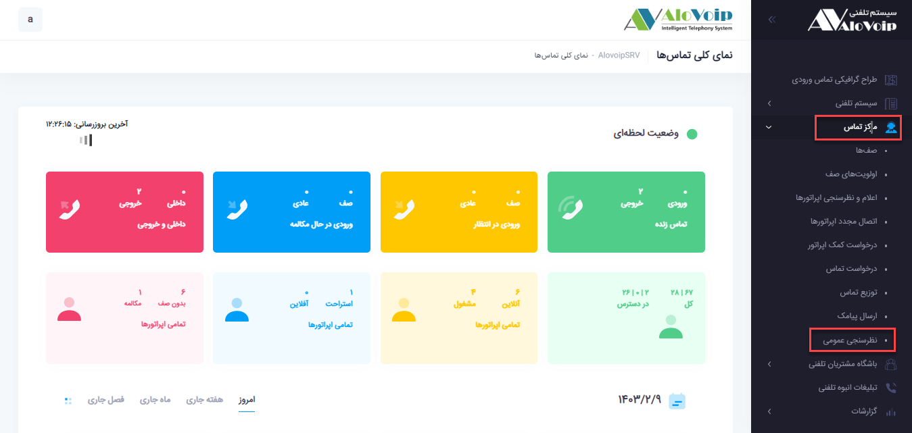
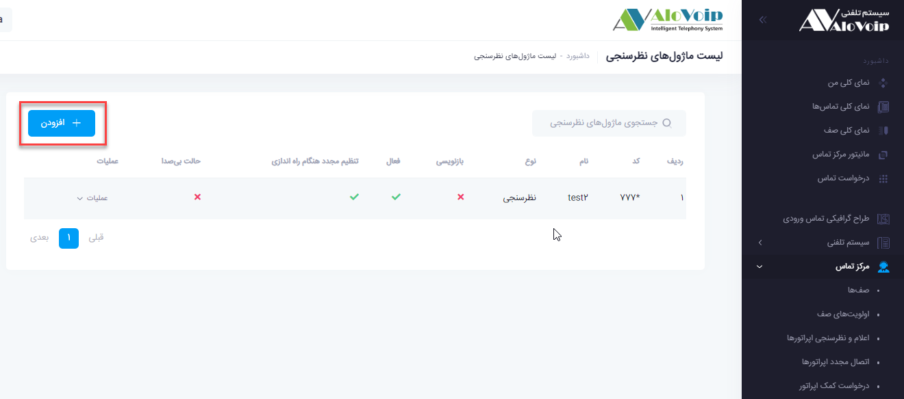
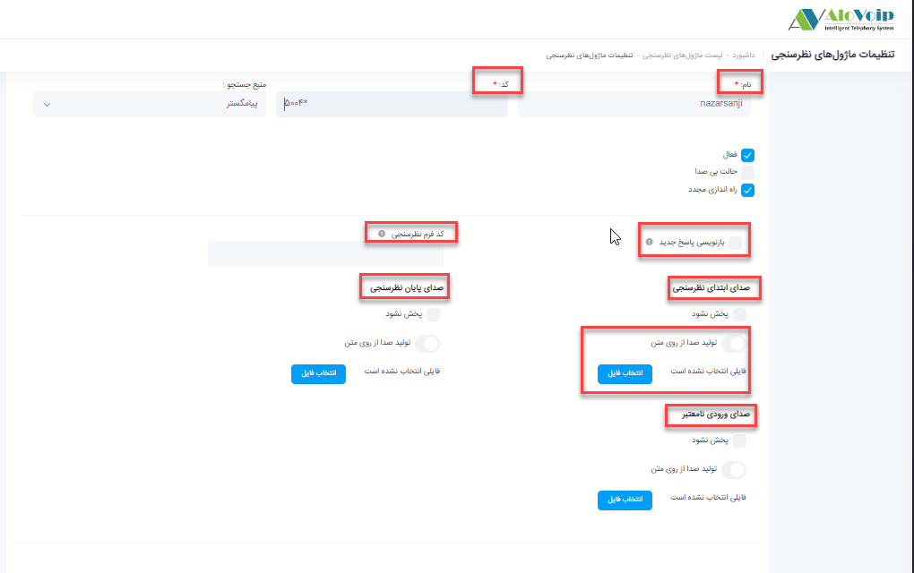
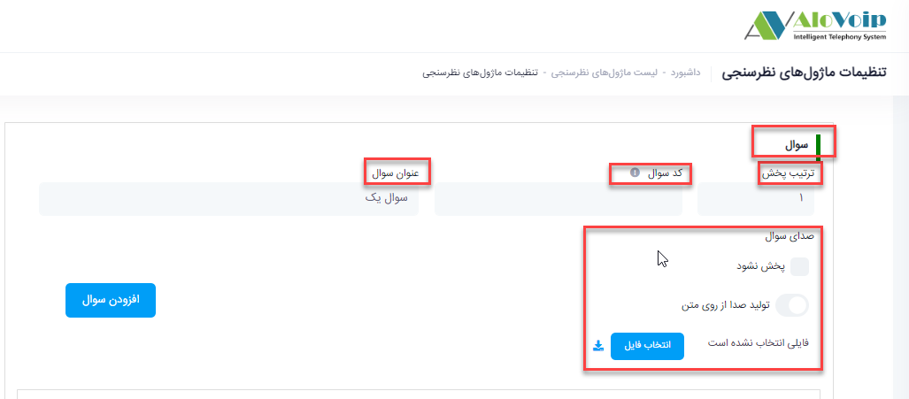
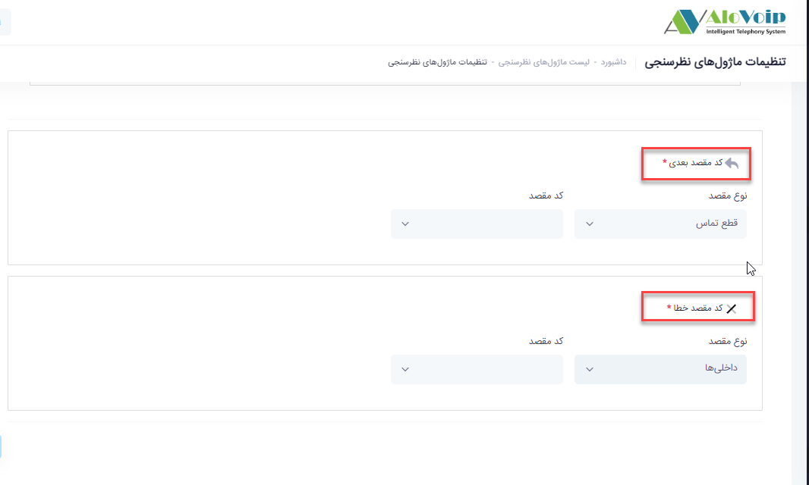
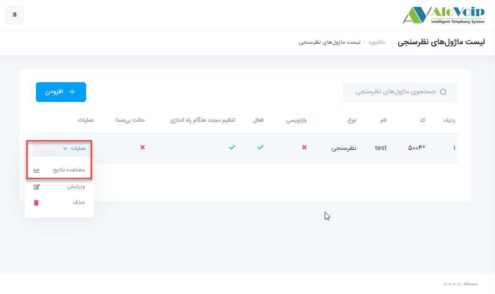
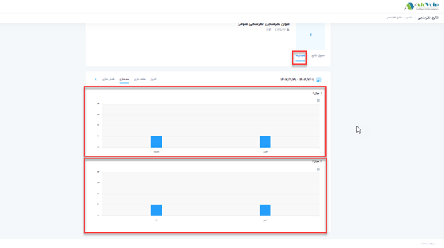
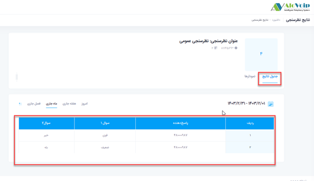

# نظرسنجی عمومی

در این بخش به موضوعات زیر می‌پردازیم:

•	[هدف از تنظیم ماژول نظرسنجی عمومی ](#ThePurposeOfSettingThePublicSurveyModule)

•	[کاربرد ماژول نظرسنجی عمومی ](#ApplicationOfPublicSurveyModule)

• 	[تنظیم ماژول نظرسنجی عمومی در پنل الوویپ ](#SettingTheGeneralSurveyModuleInThe)

• [نحوه استفاده از ماژول نظرسنجی ](#HowToUseTheSurveyModule)

•	[مشاهده نتایج نظرسنجی ](#ViewSurveyResults)

## هدف از تنظیم ماژول نظرسنجی عمومی{#ThePurposeOfSettingThePublicSurveyModule}

نظرسنجی عمومی این امکان را برای شما فراهم می‌کند که از چندین نظرسنجی تحت عنوان پرسش و پاسخ داشته باشید.یعنی وقتی مشتری وارد نظرسنجی اول می‌شود و نظر خود را ثبت می‌کند، اتوماتیک به نظرسنجی دوم، سوم و... هدایت شود.

## کاربرد ماژول نظرسنجی عمومی{#ApplicationOfPublicSurveyModule}

از این ماژول می‌توانید برای نظرسنجی کل سازمان استفاده کنید.مثلا در منشی تلفنی یک عددی را برای نظرسنجی کل شرکت اختصاص دهید .

## تنظیم ماژول نظرسنجی عمومی{#SettingTheGeneralSurveyModuleInThe}

برای راه اندازی این ماژول در پنل الوویپ از قسمت **مرکز تماس > نظرسنجی عمومی** را انتخاب کنید.روی  **افزودن**  کلیک کنید.

• در صفحه باز شده یک **نام و یک کد** منحصر به فرد درنظر بگیرید

•	**بازنویسی پاسخ جدید**

با انتخاب این گزینه این امکان فراهم می‌شود که اگر یک تماسی چند بار وارد این نظرسنجی  شده باشد و رای داده باشد، هر رای که می‌دهد جای رای قبلی می‌نشیند و باز نویسی می‌شود. ولی اگر این گزینه را انتخاب نکنید هربار که وارد نظرسنجی می‌شوید هر رای شما جداگانه محاسبه می‌شود

•	**کد فرم نظرسنجی**

شما می‌توانید نتیجه این نظرسنجی را  در crm خود داشته باشید به این شرط که کدی که مربوط به فرم نظرسنجی در crm است را باید در این قسمت وارد کنید

• 	**صدای ابتدای نظر سنجی**

شما می‌توانید تعیین کنید که اگر کسی وارد نظرسنجی شد صدایی برای او پخش شود.که این صدا می‌تواند بصورت رباتیک پخش شود و یا خودتان آن را آپلود کنید

•	**صدای پایان نظرسنجی**

می‌توانید برای پایان نظرسنجی خود یک صدا در نظر بگیرید. یعنی بعد از آنکه تماس گیرنده نظر خود را وارد کرد یک صدا برای او پخش شود.این صدا را هم می‌توانید بصورت رباتیک انتخاب و یا خودتان آپلود کنید.

• **صدای ورودی نامعتبر**

اگر تماس گیرنده در حین نظردهی عددی را که جزء اعداد تعیین شده نیست انتخاب کند با انتخاب صدا بصورت رباتیک یا آپلود شده می‌توانید به او اطلاع دهید که ورودی نامعتبر است.

•	**سوال**

در این بخش سوال های مدنظر خود را وارد می‌کنید.

•	**ترتیب پخش**

در این قسمت ترتیب سوال های مدنظرتان را مشخص می‌کنید.مثلا عدد یک را وارد می‌کنید.

•	**کد سوال**

کد مرتبط با سوالی که در نرم افزار crm مشخص کردید را  باید در این قسمت وارد کنید.

•	**عنوان سوال**

برای سوال خود یک عنوانی در نظر می‌گیرید.به عنوان مثال سوال یک

•	**صدای سوال**

صدای سوال مدنظرتان را در این قسمت بصورت رباتیک یا آپلود شده انتخاب می‌کنید

•	**گزینه های سوال**

گزینه های سوال را در این قسمت باید وارد کنید.

•	**ترتیب پخش**

در این قسمت ترتیب پخش گزینه های سوال را مشخص می‌کنید.

•	**عنوان**

عنوان آن گزینه را مشخص می‌کنید.

•	**مقدار ورودی** را نیز در این قسمت تعیین می‌کنید.

•	یک **امتیاز** برای آن در نظر می‌گیرید

روی **افزودن** که کلیک کنید این گزینه به سوالتان اضافه می‌شود.به همین ترتیب گزینه های دیگر را هم وارد کنید.
سپس  روی گزینه **افزودن سوال**کلیک کنید تا سوالتان هم به این نظر سنجی اضافه شود.
در انتها دکمه ثبت را انتخاب کنید.
بدین ترتیب سوال اول اضافه می‌شود و سوال های بعدی را هم به همین روش می‌توانید اضافه کنید.
اگر سوال را قبلا ثبت کرده بودید و در حال ویرایش آن هستید روی گزینه **ویرایش** کلیک کنید.

**کد مقصد بعدی**

در این قسمت مشخص می‌کنید که اگر یک تماس وارد نظرسنجی شدبعد از پایان نظرسنجی به چه مقصدی هدایت شود.

•	**کد خطا**

اگر تماس گیرنده تمایلی نداشت در نظرسنجی شرکت کند و تماس را قطع کرد چه اتفاقی بیفتد و آن تماس به کجا هدایت شود.این مورد را در کدخطا مشخص می‌کنید.

## نحوه استفاده از ماژول نظرسنجی{#HowToUseTheSurveyModule}

در قسمت منشی تلفنی می‌توانید با انتخاب مقاصد متفرقه و انتخاب این نظرسنجی، آن را در این قسمت هم داشته باشید.

## مشاهده نتایج نظرسنجی{#ViewSurveyResults}

برای مشاهده نتایج نظرسنجی ابتدا نظرسنجی مورد نظر را پیدا کرده و در قسمت **عملیات**، گزینه **مشاهده نتایج** را انتخاب کنید.در قسمت جدول نتایج، نتایج مربوط به تمام سوال های تعیین شده به همراه شماره شرکت کننده نمایش داده می‌شود.همچنین در قسمت نمودار هم می‌توانید بصورت نموداری این نتایج را مشاهده کنید.

