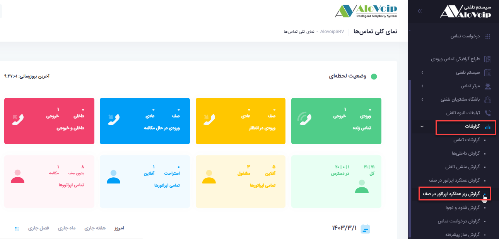
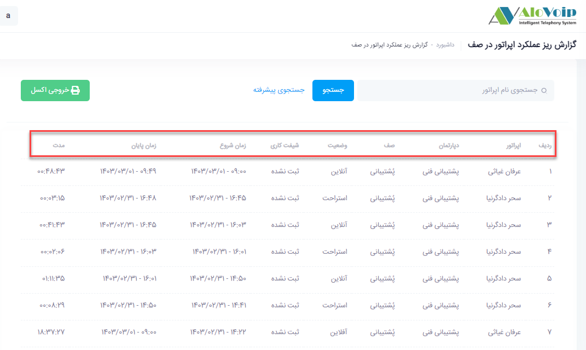
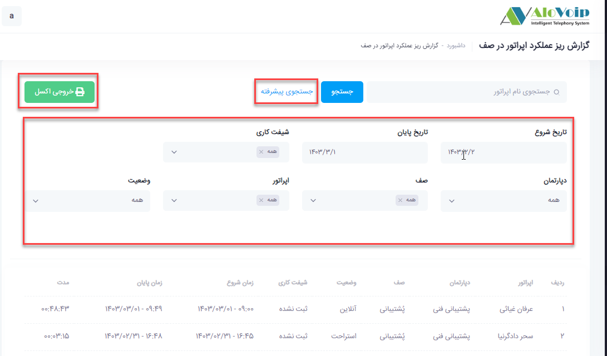

# گزارش ریز عملکرد اپراتور در صف

در این بخش به موضوعات زیر می‌پردازیم:

- [ مقدمه ](#ThePurposeOfReportingTheFinePerformanceOfTheOperatorInTheQueue)
- [مشاهده گزارش ریز عملکرد اپراتور در صف](#ViewingTheMicroPerformanceReportOfTheOperatorInTheQueue)
- [جستجو و فیلتر گزارش ](#SearchAboutFilteringReport)

## (مقدمه){#ThePurposeOfReportingTheFinePerformanceOfTheOperatorInTheQueue}
در پنل الوویپ، با توجه به نوع بسته خریداری‌شده، اپراتورهایی که در صف تماس قرار دارند می‌توانند در چهار وضعیت مختلف فعالیت کنند: **آنلاین،** **آفلاین،** **مشغول به کار** و **استراحت**.

گزارش ریز عملکرد اپراتور در صف، آماری دقیق از زمان حضور اپراتورها در هر یک از این وضعیت‌ها را ارائه می‌دهد و به مدیران کمک می‌کند تا میزان بهره‌وری و ساعات کاری کارشناسان را به‌صورت شفاف ارزیابی نمایند.

## (مشاهده گزارش ریز عملکرد اپراتور در صف){#ViewingTheMicroPerformanceReportOfTheOperatorInTheQueue}
برای مشاهده‌ی این گزارش، از منوی **گزارشات** > **گزارش** **ریز** **عملکرد** **اپراتور** **در** **صف** در پنل الوویپ وارد شوید. در صفحه‌ی مربوطه، اطلاعات جامعی از فعالیت هر اپراتور نمایش داده می‌شود؛ از جمله

- 	نام اپراتور
-	دپارتمان مربوطه
-	صفی که اپراتور در آن قرار دارد
-	وضعیت فعلی اپراتور (**آنلاین،** **آفلاین،** **مشغول** یا در حال **استراحت**)
-	شیفت کاری
-	زمان شروع و پایان هر وضعیت
-	و مجموع مدت‌زمان حضور در هر حالت

## ( جستجو و فیلتر گزارش){#SearchAboutFilteringReport}

در قسمت جستجوی پیشرفته هم می‌توانید بر اساس **تاریخ** ، شیفت کاری ، **دپارتمان،** **صف،** اپراتور و حتی وضعیت اپراتورها فیلتر داشته باشید.در آخر هم می‌توانید خروجی  اکسل تهیه کنید.

