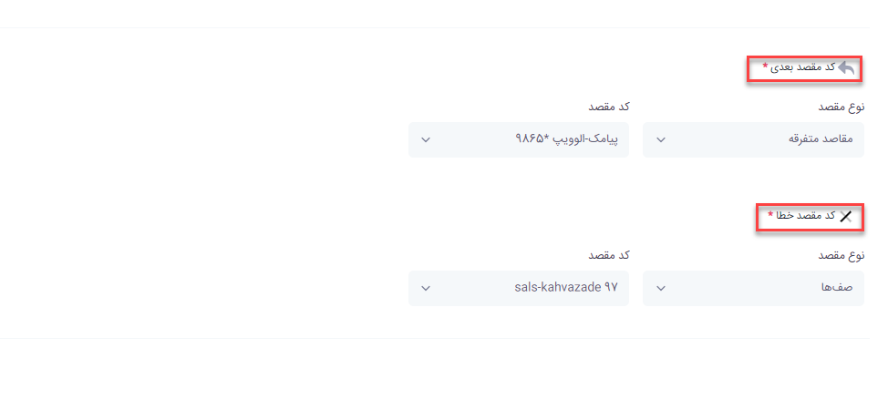

# نظرسنجی در صف

در این بخش به موضوعات زیر می‌پردازیم:
- [هدف از تنظیم ماژول نظرسنجی ](#ThePurposeOfSettingTheSurveyModule)
- [تنظیم ماژول نظرسنجی ](#SettingUpTheSurveyModule)
- [اعلام اپراتور](#AnnouncementOfTheOperator)
- [مشاهده نتایج نظرسنجی](#ViewSurveyResults)

## هدف از تنظیم ماژول نظرسنجی{#ThePurposeOfSettingTheSurveyModule}
فرض کنید در یک سازمانی هستید که واحد پشتیبانی دارید و مشتریانی به این واحد وصل می‌شوند.شما می‌خواهید روی این واحد نظارت داشته باشید و متوجه شوید مشتریانی که وارد صف پشتیبانی می‌شوند از کدام یک از کارشناسان رضایت 
بیشتری دارند.برای انجام این کار باید- نظرسنجی را راه اندازی کنید.

## تنظیم ماژول نظرسنجی {#SettingUpTheSurveyModule}
- برای تنظیم نظرسنجی در قسمت مرکز تماس وارد اعلام و نظرسنجی اپراتورها شوید. روی افزودن کلیک کنید. 

- در صفحه باز شده یک اسم و یک کد منحصر به فرد در نظر بگیرید.
- برای اینکه نظر سنجی فعال شود حتما باید گزینه های فعال و راه اندازی مجدد را انتخاب کنید.
- از قسمت صف ، صفی که می‌خواهید نظرسنجی برایش راه اندازی کنید را انتخاب کنید.

## اعلام اپراتور{#AnnouncementOfTheOperator}
- در این قسمت می‌توانید فعال سازی اعلام اپراتور را هم فعال کنید و با زدن گزینه های  پخش داخلی اپراتور بجای نام و گزینه های صدای پیش از معرفی و پس از معرفی باعث می‌شود زمانی که تماس وارد این صف می‌شود برای آن فرد تماس گیرنده صدای شماره داخلی اپراتور پخش شود.اگر بخواهید  بجای اعلام نام داخلی ، نام و نام خانوادگی اپراتور اعلام شود باید در پنل کاربری آن اپراتور صدای نام و نام خانوادگی را بارگذاری کنید.

- برای راه اندازی نظرسنجی گزینه فعالسازی نظرسنجی را انتخاب کنید.شما در این قسمت نیاز به سه صدا دارید که شامل صدای نظرسنجی، ورودی نامعتبرو عملیات موفق می‌باشد. این صداها را می‌توانید بصورت رباتیک با انتخاب تولید صدا از روی متن و یا با بارگذاری صدای ضبط شده انتخاب کنید.در قسمت عدد ورودی اعلام می‌کنید نظرسنجی شما از چه عددی تا چه عددی باشد که  باید بازه ی این اعداد 1 تا 5 باشد.

- **کد بعدی**
در این قسمت می‌توانید تعریف کنید بعد از اینکه نظرسنجی ثبت شد به چه مقصدی تماس هدایت شود.
- **کدخطا**
در این قسمت می‌توانید تعیین کنید اگر نظرسنجی انجام نشد و به خطایی برخورد کرد آن تماس به داخلی دیگری یا مقصد دیگری هدایت شود.

## مشاهده نتایج نظرسنجی{#ViewSurveyResults}
می ‌توانید در قسمت نمای کلی صف،بخش رضایت مشتری نتایج نظرسنجی بصورت گرافیکی مشاهده، و با کلیک کردن بر روی آن ،گزارش نظرات ثبت شده را دید و دانلود نمود. از این نتایج نیز می‌توانید خروجی اکسل تهیه کنید

همچنین هر اپراتور نیز در  پنل کاربری خود میتواند نتایج نظرسنجی خود را مشاهده کند

