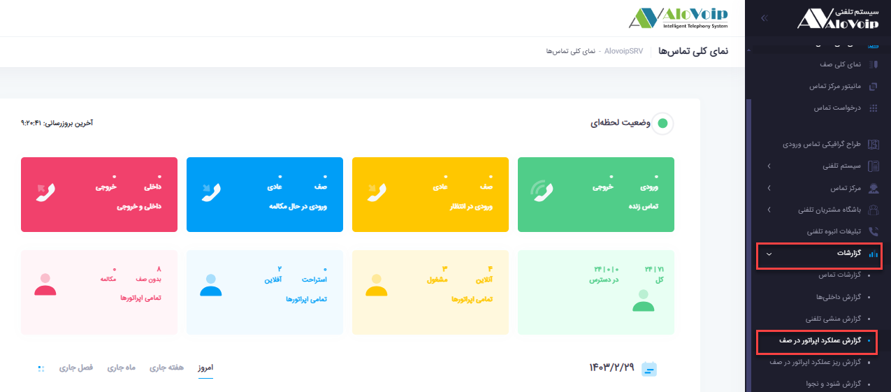
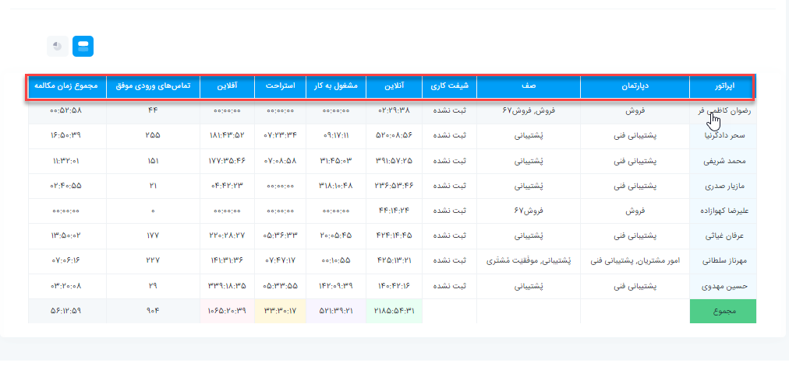
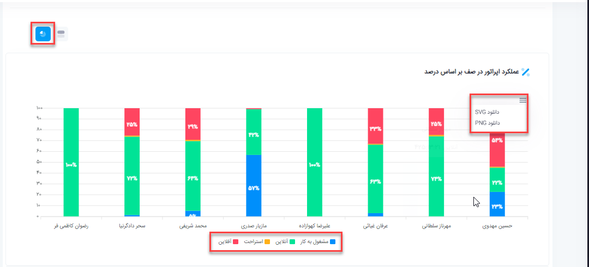
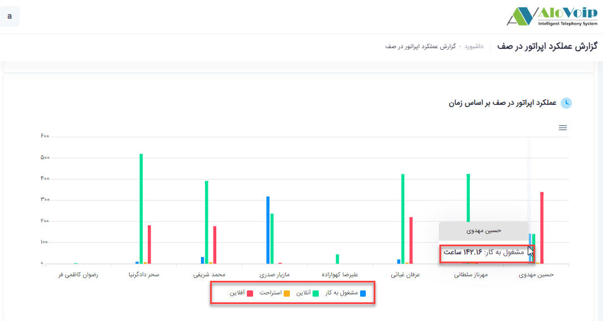
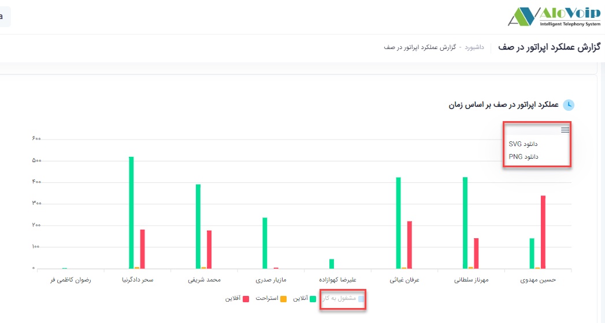
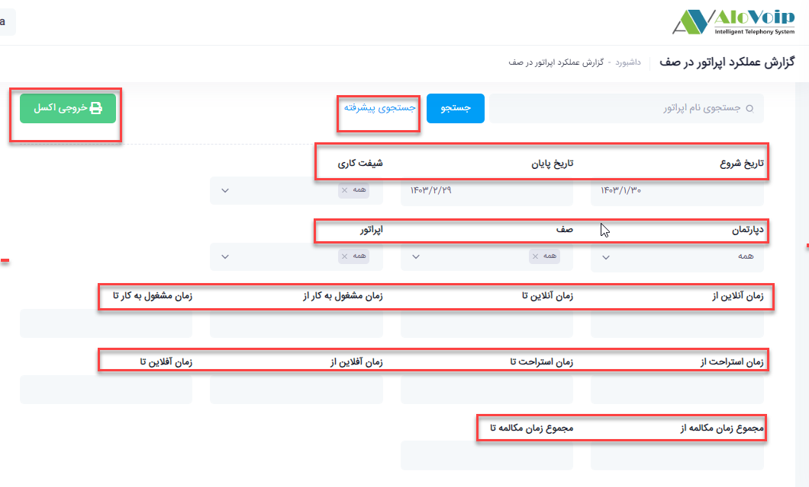

# گزارش عملکرد اپراتور در صف

در این بخش به موضوعات زیر می‌پردازیم:
- [ مقدمه ](#ThePurposeOfReportingThePerformanceOfTheOperatorInTheQueue)
- [مشاهده گزارش عملکرد اپراتور در صف](#ViewThePerformanceOfTheOperatorInTheQueue)
- [گزارش درصدی عملکرد اپراتورها](#OperatorPerformancePercentageReport)

## ( مقدمه ){#ThePurposeOfReportingThePerformanceOfTheOperatorInTheQueue}
با توجه به نوع بسته‌ی خریداری‌شده و تعداد اپراتورهای فعال، امکان تعریف اپراتورهای جدید در سامانه الوویپ وجود دارد. این اپراتورها هنگام حضور در صف تماس می‌توانند در چهار وضعیت کاری قرار گیرند: **آنلاین، آفلاین، مشغول به کار و استراحت** .  
در این بخش، مدیران سازمان قادر خواهند بود **گزارش جامع عملکرد اپراتورها** را مشاهده و تحلیل نمایند تا دید دقیق‌تری نسبت به میزان فعالیت، بهره‌وری و پاسخ‌گویی کارشناسان خود داشته باشند

## (مشاهده گزارش عملکرد اپراتور در صف){#ViewThePerformanceOfTheOperatorInTheQueue}
- برای مشاهده‌ی این گزارش، از منوی **گزارشات > گزارش عملکرد اپراتور در صف در پنل الوویپ** استفاده کنید. در صفحه‌ی نمایش داده‌شده، اطلاعات جامعی از عملکرد اپراتورها در صف‌های مختلف مشاهده می‌گردد، از جمله:
-	دپارتمان و صف کاری اپراتور
-	شیفت فعالیت
-	مدت‌زمان آنلاین، آفلاین، در حال استراحت و مشغول به کار بودن
-	تعداد تماس‌های ورودی موفق
-	مجموع زمان مکالمه در بازه‌ی انتخاب‌شده

## ( گزارش درصدی عملکرد اپراتورها ){#OperatorPerformancePercentageReport}

- در بخش پایین‌تر صفحه‌ی گزارش، با انتخاب گزینه‌ی مشخص‌شده در تصویر، می‌توانید عملکرد اپراتور در صف را بر اساس درصد مشاهده کنید. این بخش عملکرد اپراتور را به‌صورت نمودار میله‌ای نمایش می‌دهد که قابلیت دانلود در قالب **PNG** و **SVG** نیز دارد

 
- به‌عنوان مثال، در بخش عملکرد اپراتور بر اساس زمان ممکن است نمایش داده شود که اپراتور «حسین مهدوی» در طول بازه‌ی انتخابی 142.16 ساعت مشغول به کار، 142.7 ساعت آنلاین، 339.31 ساعت آفلاین و 5.57 ساعت در حالت استراحت بوده است.

- با بردن نشانگر موس روی بخش‌های مختلف نمودار، جزئیات زمانی مربوط به هر وضعیت نمایش داده می‌شود. همچنین با کلیک بر روی هر بخش از نمودار، می‌توانید آن قسمت را از نمای گرافیکی حذف یا اضافه نمایید.

- در قسمت جستجوی پیشرفته، امکان فیلتر کردن داده‌ها بر اساس معیارهای مختلف وجود دارد، از جمله:
-	تاریخ (به‌صورت پیش‌فرض، بازه‌ی یک‌ماهه در نظر گرفته می‌شود)
-	شیفت کاری
-	دپارتمان و صف تماس
-	نام اپراتور
-	مدت‌زمان فعالیت در وضعیت‌های مختلف (آنلاین، مشغول به کار، استراحت، آفلاین)
-	مجموع زمان مکالمه
در نهایت گزارش را می‌توانید به‌صورت فایل خروجی اکسل دریافت کنید تا امکان ذخیره‌سازی و تحلیل‌های آماری دقیق‌تر فراهم شود.

