در این بخش به موضوعات زیر می‌پردازیم: 
- [هدف از نمای کلی صف در پنل الوویپ](#PurposeOfTheQueueOverviewInTheHelloVoIPPanel)
- [نمای کلی صف](#QueueOverview)
- [نمای کلی](#Overview)
- [اپراتورها](#Operators)
- [عملکرد اپراتور در صف](#OperatorFunctionIQueue)
- [رضایت مشتری](#CustomerSatisfaction)
## هدف از نمای کلی صف در پنل الوویپ{#PurposeOfTheQueueOverviewInTheHelloVoIPPanel}
هدف از نمای کلی صف دستیابی سریع و کامل به نحوه عملکرد اپراتور ها و  گزارش صف های ساخته شده در سازمان می‌باشد.

## نمای کلی صف{#QueueOverview}
برای ورود به قسمت نمای کلی صف، در پنل الوویپ از قسمت **داشبورد > نمای کلی صف** را انتخاب کنید. صفحه باز شده شامل 4 گزینه **نمای کلی، اپراتورها، عملکرد اپراتور در صف و رضایت مشتری** است که به بررسی هر قسمت می‌پردازیم. 

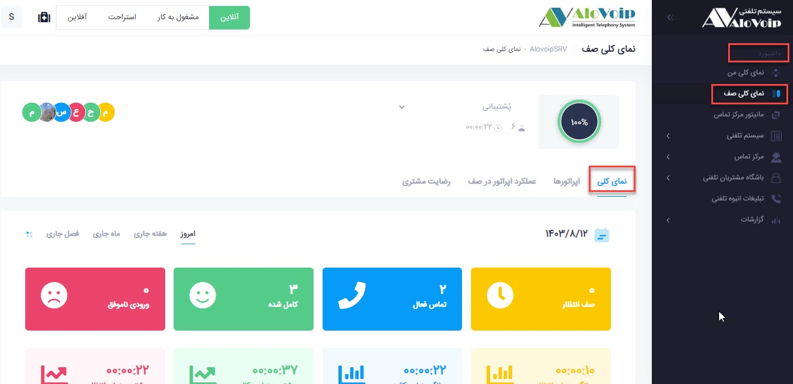

## نمای کلی{#Overview}
در قسمت **نمای کلی**، شما می‌توانید بر روی صف های خود نظارت و مدیریت داشته باشید.

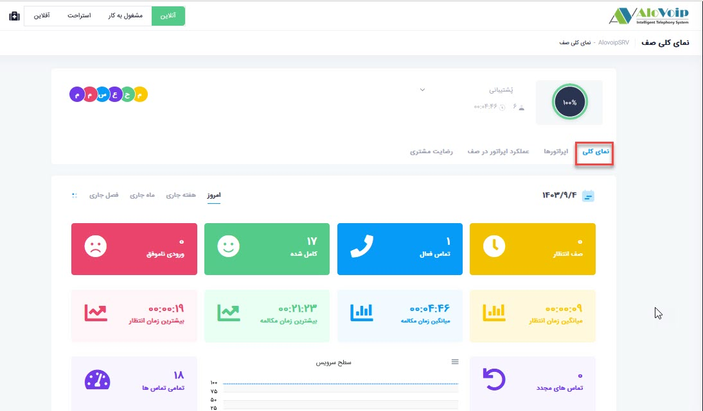

1.	بدین صورت که در بالای صفحه سمت راست، تمامی صف های شما نشان داده می‌شود که با انتخاب صف مورد نظر می‌توانید اطلاعات زیر را از هر صف بدست آورید 

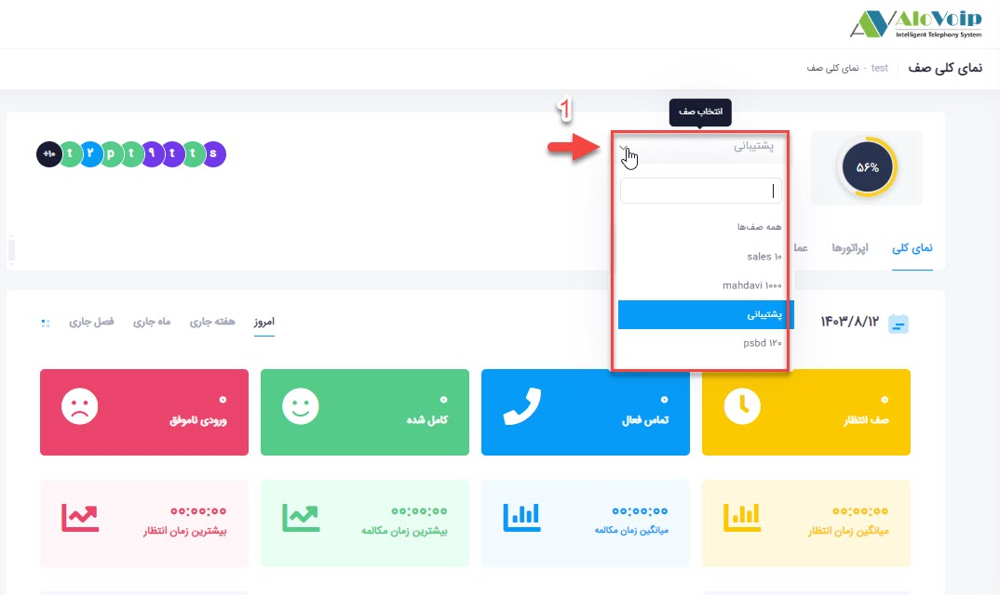

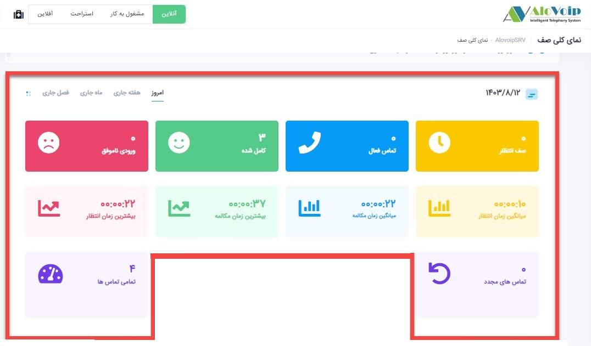

- صف انتظار: تعداد تماس هایی که در حال انتظار و وصل شدن به اپراتورها هستند را نشان می‌دهد.
- تماس فعال: چند کارشناس شما در حال مکالمه هستند.
- تماس کامل شده: تعداد تماس های پاسخ داده شده توسط کارشناسان شما را نشان می‌دهد.
- ورودی ناموفق: تعداد تماس هایی که توسط کارشناسان شما پاسخ داده نشده اند را نشان می‌دهد.توجه داشته باشید این مقدار نمایش داده شده تعداد تماس های ناموفقی محسوب می‌شود که تماس گیرنده پس از زمان تعیین شده در قسمت حداقل زمان انتظار که در تنظیمات پیشرفته صف اعمال شده است، تماس را قطع کند نمایش داده می‌شود.(به مقاله تنظیمات صف مراجعه شود)
- میانگین زمان انتظار:  در این قسمت مشخص می‌کند میانگین زمان انتظار در صف چقدر بوده است.
- میانگین زمان مکالمه: مشخص می‌کند میانگین زمان مکالمه در صف انتخابی چه مقدار بوده است.
- بیشترین زمان مکالمه: بیشترین رمان مکالمه در صف را نشان می‌دهد.
- بیشترین زمان انتظار: بیشترین زمان انتظار در صف را مشخص می‌کند.
- تماس های مجدد: در این فیلد اگر تماسی که به صف مورد نظر وارد شده توسط هیچکدام از داخلی های صف پاسخ داده نشود و مجدد شخص تماس بگیرد و این بار تماس توسط کارشنایان شما پاسخ داده شود این تماس به عنوان تماس مجدد ثبت می‌شود.
- تمامی تماس ها: تعدادتماس های وارد شده به صف را نشان می‌دهد.

>نکته:  با انتخاب همه صف ها اطلاعات مربوط به تمامی صف ها نشان داده می‌شود.همچنین امکان فیلتر بر اساس زمان مورد نظر را دارید.

2.	در قسمت بالای صفحه سمت چپ اپراتور هایی که در هر صف هستند را نشان می‌دهد که با انتخاب هر اپراتور می‌توانید وارد پنل کاربری آن شوید.

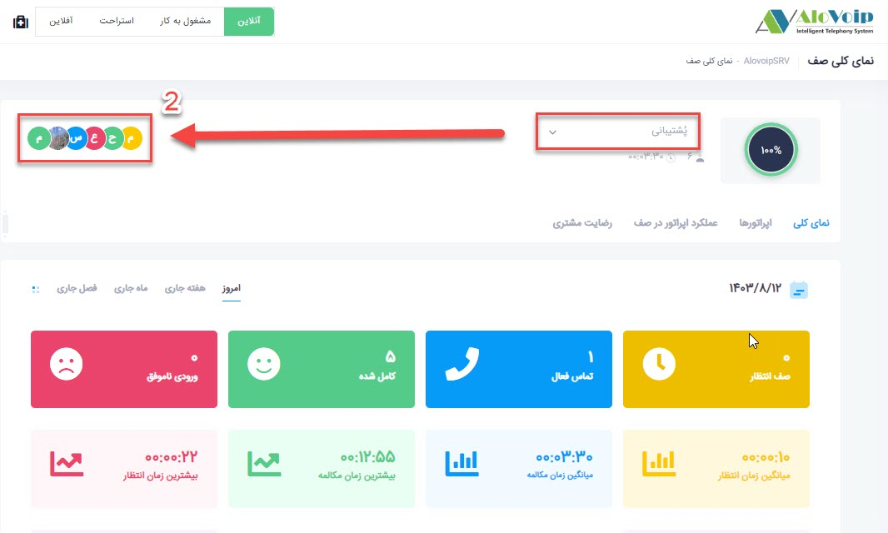

3.	[در قسمت سطح سرویس، سطح سرویس هر صف نشان داده شده است که درباره SLA و سطح سرویس در مقاله صف ها بطور کامل پرداخته شده است.](https://helpcenter.alovoip.ir/MonitoringAndReporting%20/%D9%86%D8%AD%D9%88%D9%87-%D8%AA%D9%86%D8%B8%DB%8C%D9%85-%D8%A8%D8%B1%D8%A7%DB%8C-%D9%87%D8%B1-%D8%B5%D9%81-%D8%AA%D9%85%D8%A7%D8%B3-SLA_di5d3a66e6-c6c9-4fb3-1b8c-08dd02401d4e)

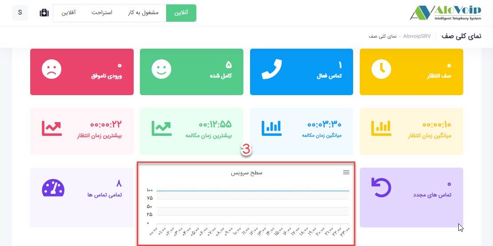

4.	در قسمت پایین صفحه،  آیتم **در صف انتظار و در حال مکالمه** را دارید. 

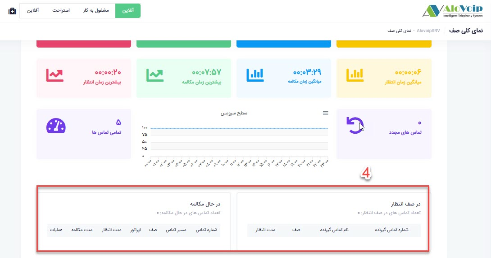
- **در صف انتظار**: در این قسمت مشاهده می‌کنید چه کسانی در صف انتخابی در حال انتظار وصل شدن به اپراتور هستند که اگر تعدادشان زیاد و یا زمان زیادی منتظر بودند بتوانید این تماس ها را مدیریت کنید. 
- **در حال مکالمه**:  تعداد تماس های در حال مکالمه در هر صف را نشان می‌دهد.
##  اپراتورها{#Operators}
در این قسمت امکان مشاهده اپراتورها  و تغییر وضعیت آنها در هر صف وجود دارد. برای این منظور کافی است مراحل زیر را طی کنید:

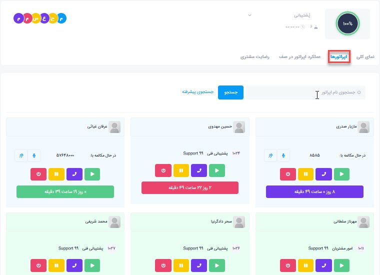

1.	صف مورد نظر را انتخاب کنید.
2.	در این قسمت اپراتورهای هر صف و  وضعیت آنها در صف نشان داده می‌شود.
3.	وضعیت هر اپراتور را می‌توانید به هرکدام از حالت های آنلاین, آفلاین, استراحت و مشغول بکار تغییر دهید.

>نکته: داخلی هر اپراتور باید در صف داینامیک باشد و بسته شما امکان آنلاین و آفلاین را باید داشته باشد تا بتوانید وضعیت آنها را تغییر دهید.

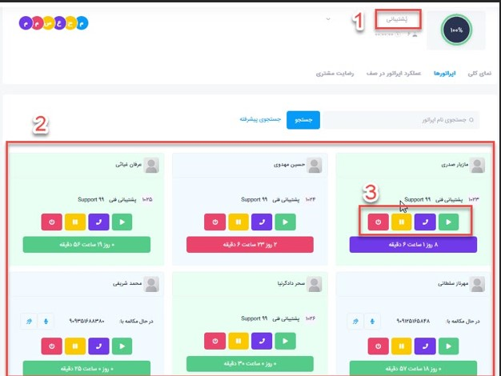

همچنین در قسمت **جستجوی پیشرفته** می‌توانید بر اساس فیلدهای(وضعیت داخلی, دپارتمان, اپراتور و وضعیت صف) جستجوی سریعتری برای پیدا کردن اپراتور مدنظر داشته باشید

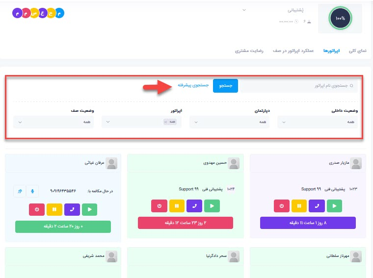

## عملکرد اپراتور در صف{#OperatorFunctionIQueue}
در این قسمت آمار عملکرد اپراتورهای هر صف را می‌توانید مشاهده کنید.

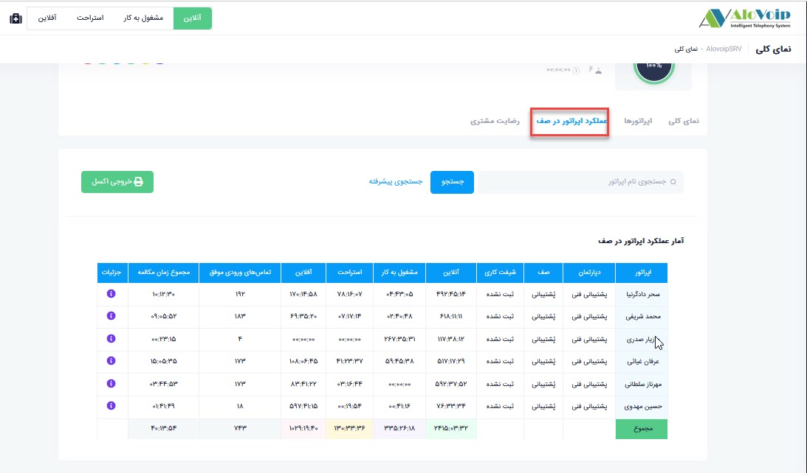

برای این منظور صف مدنظر را از گوشه سمت راست بالا انتخاب کنید که با این کار اپراتورهایی که عضو صف هستند به همراه نتایج عملکردشان به شما نمایش داده می‌شود.(داخلی اپراتور باید در صف داینامیک قرار داشته باشد)
برای مثال اپراتور دادگرنیا در دپارتمان پشتیبانی فنی و در صف پشتیبانی قرار دارد.در مدت زمان انتخابی یک ماه این اپراتور 492:45:14 ساعت آنلاین، 04:43:05 مشغول بکار، 78:16:07 در حال استراحت و170:14:58 آفلاین بوده است.190 تماس ورودی موفق و10:11:51 مجموع زمان مکالمه داشته است.

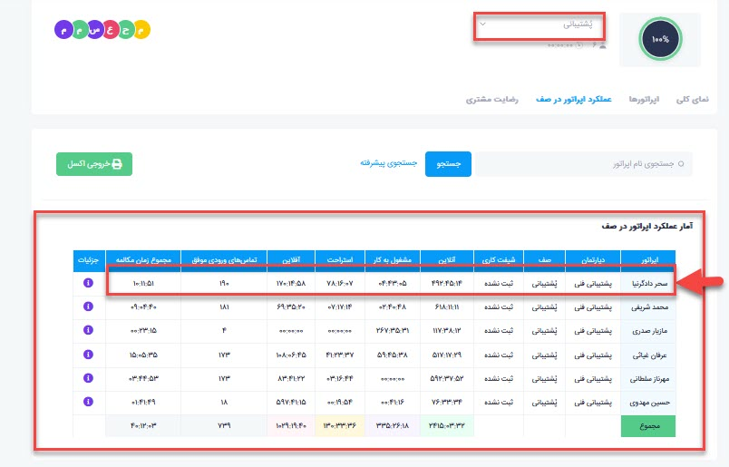

همچنین در قسمت **جستجوی پیشرفته** می‌توانید جستجوی دقیقتری داشته باشید. برای این منظور تاریخ شروع و تاریخ پایان مدنظر خود را انتخاب کنید. سپس بر اساس فیلدهای مدنظر(**شیفت کاری، دپارتمان،اپراتور، زمان آنلاین، زمان مشغول بکار،زمان استراحت، زمان آفلاین و مجموع زمان مکالمه**) می‌توانید جستجوی سریعتری داشته باشید.در نهایت از این نتایج  می‌توانید خروجی اکسل تهیه کنید.

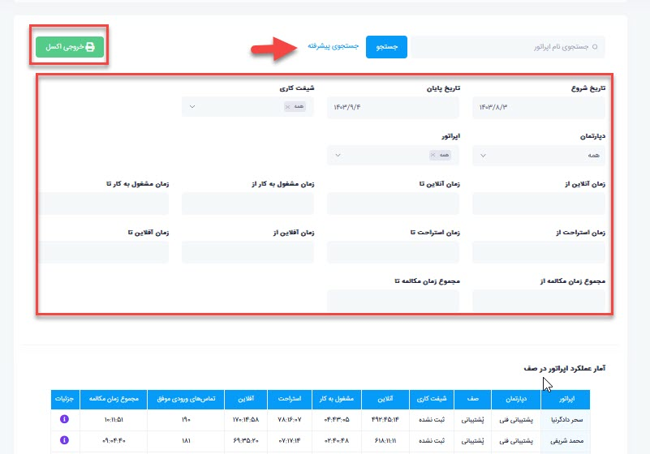

## رضایت مشتری{#CustomerSatisfaction}
در این قسمت اگر بسته شما شامل ماژول نظرسنجی در صف باشد و برای شما این ماژول تنظیم شده باشد می‌توانید نتایج نظرسنجی را بر اساس فیلتر زمانی بصورت گرافیکی مشاهده کنید. 

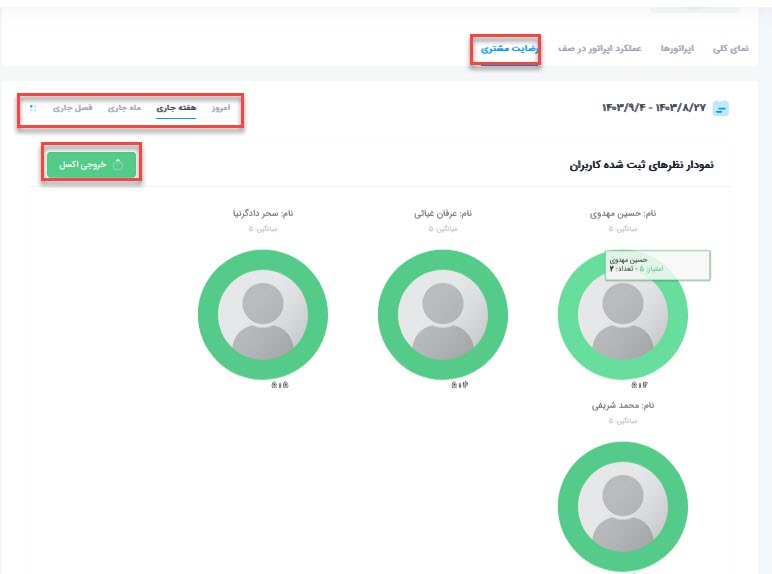

همچنین با کلیک کردن بر روی نماد گرافیکی هر اپراتور ،گزارش نظرات ثبت شده را می‌توانید مشاهده و دانلود نمود. از این نتایج نیز می‌توانید خروجی اکسل تهیه کنید.

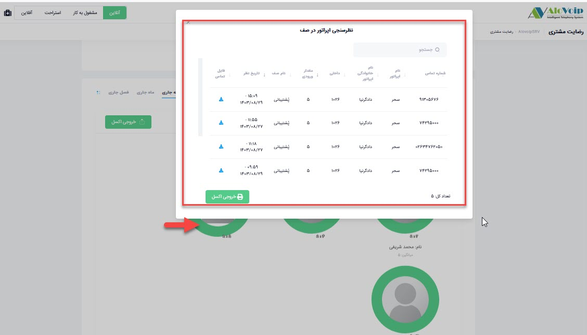

>نکته:   توجه داشته باشید به ازای داخلی هایی که می‌خواهید برای آنها نظرسنجی ثبت شود باید اپراتور بسازید تا نتایج آن اپراتورها در این قسمت نمایش داده شود.
همچنین امکان نمایش نتایج نظرسنجی بصورت ستونی هم وجود دارد.
