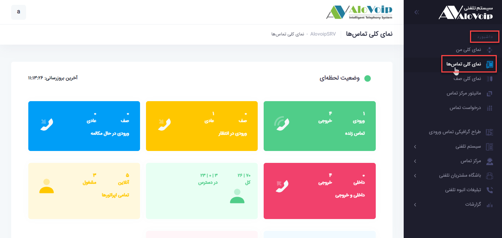
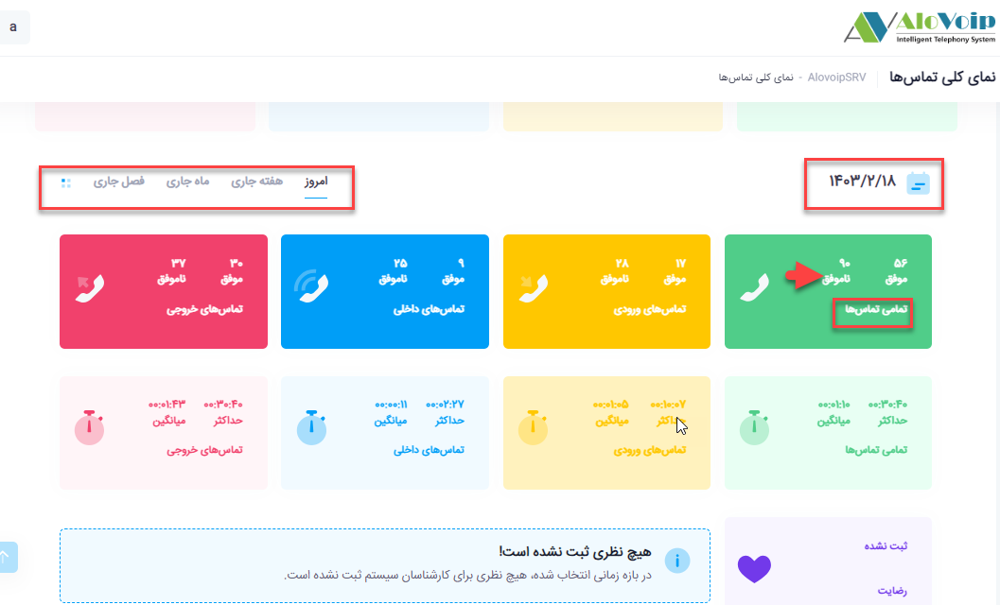
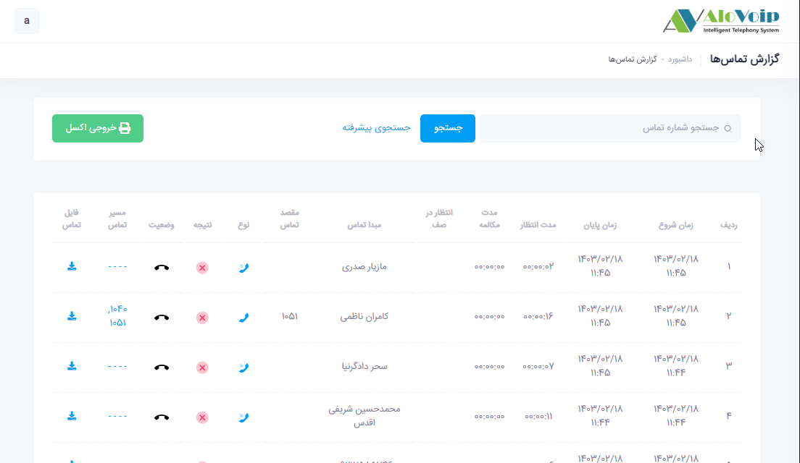
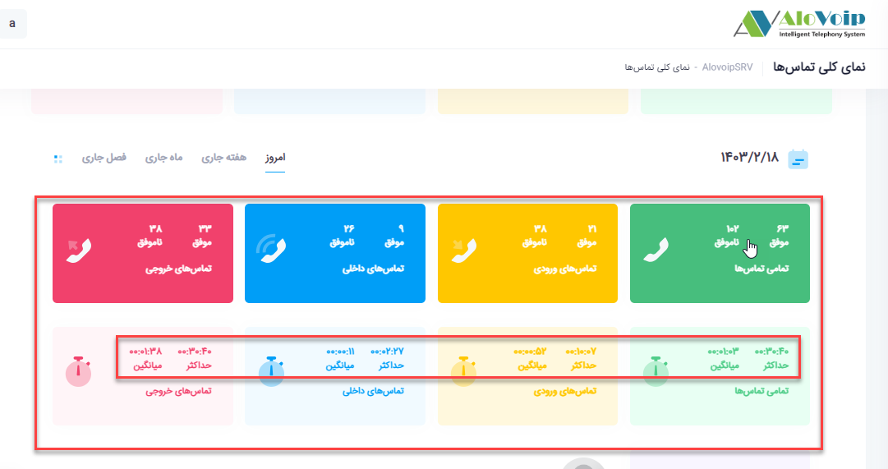
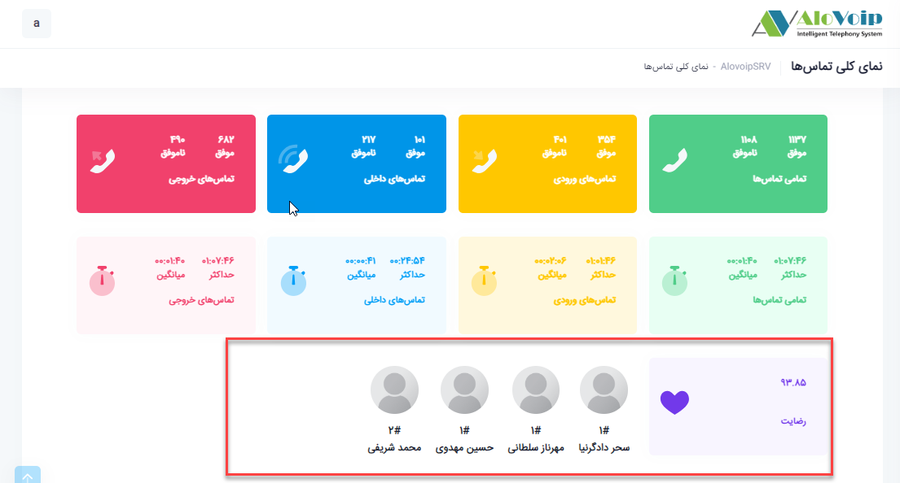
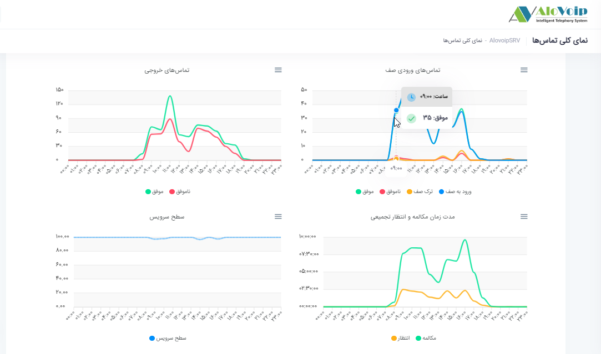
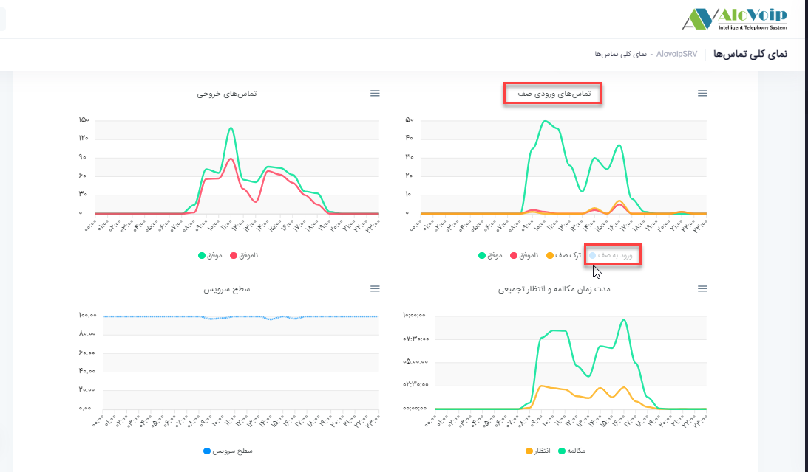
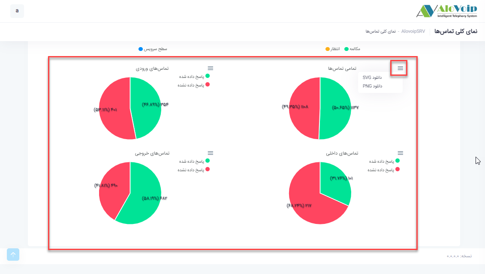
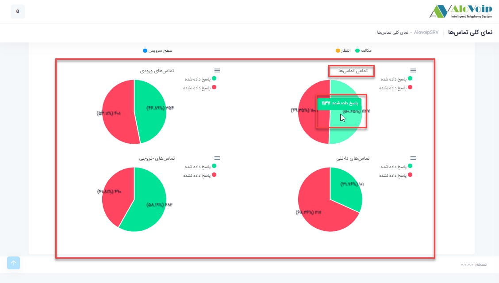

# نمای کلی تماس ها

در این بخش به موضوعات زیر می‌پردازیم:

•	[هدف از نمای کلی تماس ها ](#PurposeOfContactsOverview)

•	[بخش های مختلف وضعیت لحظه ایی ](#DifferentPartsOfTheCurrentSituation)

## هدف از نمای کلی تماس ها{#PurposeOfContactsOverview}

نمای کلی تماس ها این امکان را به سازمان می‌دهد که وضعیت لحظه ایی تماس ها را بتوانید مشاهده کنید و حتی این وضعیت را بر اساس تاریخ مدنظر فیلتر کنید.

## بخش های مختلف وضعیت لحظه ایی{DifferentPartsOfTheCurrentSituation}

در پنل الوویپ از قسمت داشبورد روی نمای کلی تماس ها که کلیک کنید با صفحه زیر مواجه می‌شوید که از سه بخش تشکیل شده است

**بخش اول**

وضعیت لحظه ایی تماس ها را نشان می‌دهد.اگر روی وضعیت لحظه ایی کلیک کنید  در قسمت بروز رسانی همگام سازی پنل الوویپ با سرور ویپ را به شما نشان می‌دهد.

در قسمت **تماس های زنده**، تماس های زنده ورودی به سازمان و خروجی از سازمان را می‌توانید مشاهده کنید.

در قسمت **ورودی در انتظار** شما می‌توانید تماس های ورودی به سازمان که چه در صف در حال انتظار هستند و چه بصورت عادی یعنی داخلی را مستقیم گرفته اند و در حال انتظار هستند را ببینید.

در قسمت **ورودی در حال مکالمه** شما تماس های ورودی به سازمان که در صف قرار گرفته اند و در حال مکالمه هستند و حتی تماس هایی که بصورت مستقیم با داخلی در ارتباط هستند را می‌توانید مشاهده کنید.

در قسمت **داخلی و خروجی** شما می‌توانید تماس های داخلی به داخلی را مشاهده کنید.

در قسمت **تمامی داخلی ها** شما می‌توانید همه داخلی هایی که در سرور ویپتان وجود دارند مشاهده کنید.به عنوان مثال70 داخلی دارید که از آنها 27 داخلی در دسترس است از این27 داخلی در دسترس2  داخلی در حال مکالمه و25 داخلی بصورت آزاد هستند.

در قسمت **اپراتوری** وضعیت لحظه ایی، بصورت لحظه ایی می‌توانید ببینید که چه تعداد از این اپراتورها بصورت آنلاین و چه تعداد در وضعیت مشغول بکار، چه تعداد در حال استراحت و یا آنلاین قرار دارند  و حتی چه تعداد از این اپراتورها در صف قرار دارند

-	**بخش دوم**
در بخش دوم می‌توانید وضعیت تماس های خود  را برای روزهای قبل فیلتر کنید.به عنوان مثال اگر در فیلد **تمامی تماس** بخواهید تماس های ناموفق را مشاهده کنید کافی است روی ناموفق کلیک کنید تا وارد بخش گزارشات تماس شوید.

در قسمت **تماس های ورودی** هم می‌توانید مشاهده کنید که چند تماس ورودی موفق و ناموفق داشته اید.با کلیک روی هر کدام به بخش گزارشات تماس منتقل می‌شوید.

در قسمت **تماس های داخلی** هم می‌توانید تماس های داخلی به داخلی موفق و ناموفق را ببینید.

در فیلد **تماس های خروجی** می‌توانید تعدادتماس های خروجی موفق و ناموفق را مشاهده کنید.

در فیلدهای پایین هم وضعیت  تماس ها را برحسب زمان دارید.مثلا حداکثر زمان مکالمه، میانگین زمان مکالمه و...

در این قسمت هم نظرسنجی ثبت شده در سازمان را می‌توانید مشاهده کنید

•    **بخش سوم**

در این بخش وضعیت های مربوط به تماس های ورودی به صف،تماس های خروجی،مدت زمان مکالمه و تجمیعی و سطح سرویس را بصورت نموداری نشان می‌دهد.در واقع با توجه به فیلتری که در بخش دوم انتخاب می‌کنید این نمودارها تغییر می‌کند.

به عنوان مثال در نمودار **تماس های ورودی صف** اگر با ماوس روی قسمت آبی رنگ بروید به شما نشان می‌دهد در چه ساعت هایی چه تعداد تماس ورودی به صف داشته اید.

با کلیک بر روی هر کدام از چهار گزینه **ورود به صف، ترک صف، ناموفق و موفق** می‌توانید آن را از نمودار حذف کنید. 

در بخش پایین تر وضعیت تمامی تماس ها،تماس های ورودی،تماس های داخلی و تماس های خروجی را بصورت درصد در نمودار دایره ایی مشاهده کنید.

اگر روی علامتی که در عکس پایین مشخص شده است کلیک کنید می‌توانید این نمودارها را بصورتSVG  ویا PNG دانلود کنید.

همین کار را برای نمودارهای بخش بالا هم می‌توانید انجام دهید. همچنین با بردن ماوس روی هر کدام  از نمودارها مثلا نمودار **تمامی تماس ها** می‌توانید ببینید چه تعداد تماس هایی پاسخ داده شده و چه تعداد پاسخ داده نشده است.

