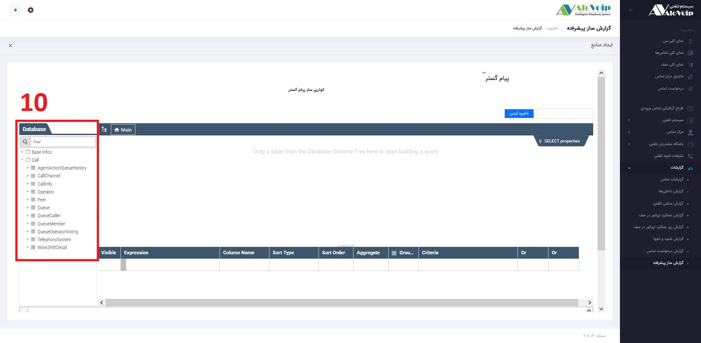
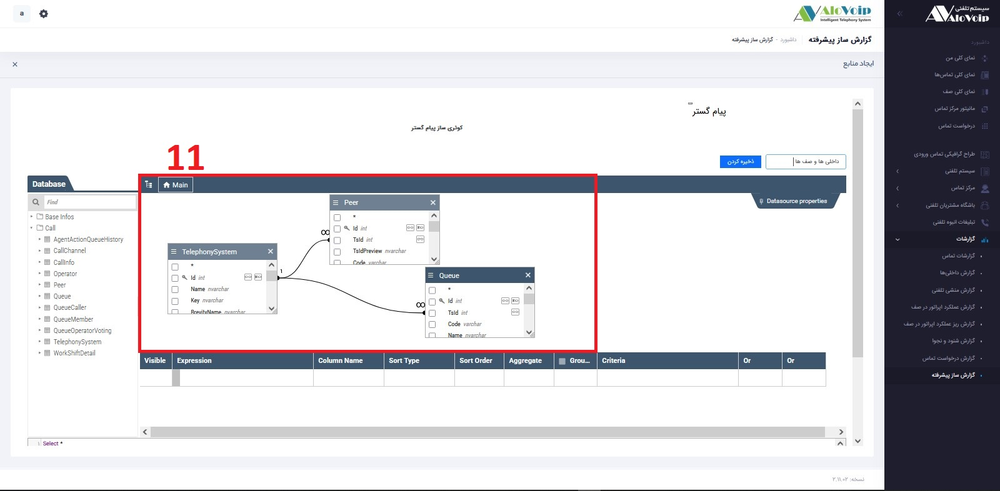
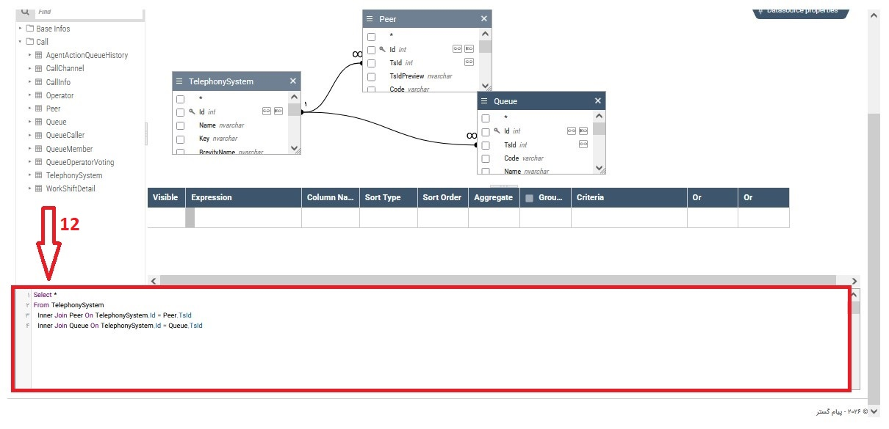
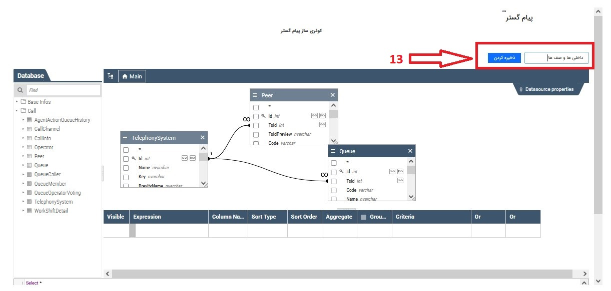
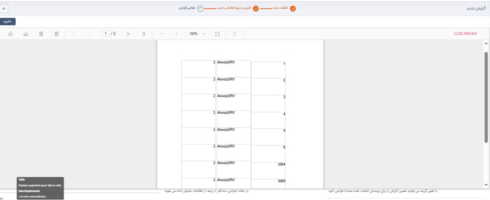

## بانک اطلاعاتی الوویپ 
**بانک اطلاعاتی الوویپ:** در صورتی که در مرحله قبل از گزینه دیتا بیس الوویپ استفاده کردید در این مرحله از منابع الوویپ زمانی استفاده می‌شود که بخواهیم علاوه بر گزارشاتی که در حال حاضر هست  که میتوان از موجودیت‌های دیگری در این گزارش استفاده کنیم.
 
 
 در این مرحله با استفاده از روش **Drag&Drop** امکان استفاده از جدول های دیتابیس که در قسمت **DataBase** میتوانید استفاده کنید
 
 

**10.  DataBase** در این قسمت **table** های دیتا بیس میتوانید با روش **drag** & **drop** استفاده کنید 

 
 

**11.  Main** در این قسمت اتصال **table** ها را به صورت **دیاگرام** مشاهده میکنید 

 **Visible:** از این بخش امکان انتخاب و یا حذف فیلد‌های انتخاب شده وجود دارد.
 
 **Expression:** در این قسمت نام فیلد‌ها نمایش داده می‌شود و اسم آن موجودیت را به‌صورت پیشوند به فیلد‌ها اضافه می‌کند تا مشخص شود هر فیلد از کدام آیتم انتخاب شده است.
 
 **Colomn Name**    اسم مربوط به هر فیلد که در مرحله بعد برای گزارش‌گیری نمایش داده می‌شود
 
 **Sort Type** می‌توانید المانی را برای مرتب‌سازی فیلد‌ها انتخاب کنید.
 
 **Criteria**  می‌توان از این بخش فیلتر‌های موردنظر بر روی هر فیلد اعمال کرد (در این مرحله برای هر فیلد می‌شود تا سه مرحله فیلتر تعریف کرد، اگر بخواهیم بیش از سه فیلتر استفاده شود باید از طریق کدنویسی در محیط SQL  پایین صفحه استفاده کرد.) 
 اگر کاربر بخواهد از روش پیشرفته‌تری گزارش داشته باشد می‌تواند از طریق کدنویسی در محیط   SQL  استفاده کند، با استفاده از این روش می‌تواند فیلتر‌های مشخصی را اعمال و یا بر اساس المانی فیلد‌ها را مرتب‌سازی کند.
 
 
 
 

12. بعد از اینکه  با استفاده از روش Drag & Drop جدول های دیتابیس در این مرحله 

 
 
 
 13. طراحی گزارش  بعد از پیاده سازی **دیاگرام** و اجرای **Query** در نهایت با اسم مورد نیاز خود میتوانید این الگو را ذخیره کنند تا به مرحله **طراحی** **گزارش** برسند.
 

 

14. نمایش گزارشات : در این مرحله ما از طریق گزارشات پیشرفته گزارشی گرفتیم که هر داخلی توی چه ای دی در دیتابیس دارند و در کدام سیستم تلفنی با چه ای دی هستند . 