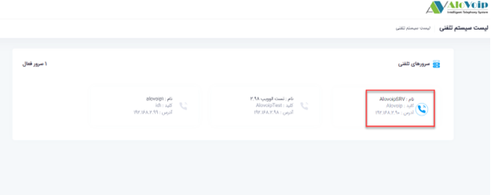
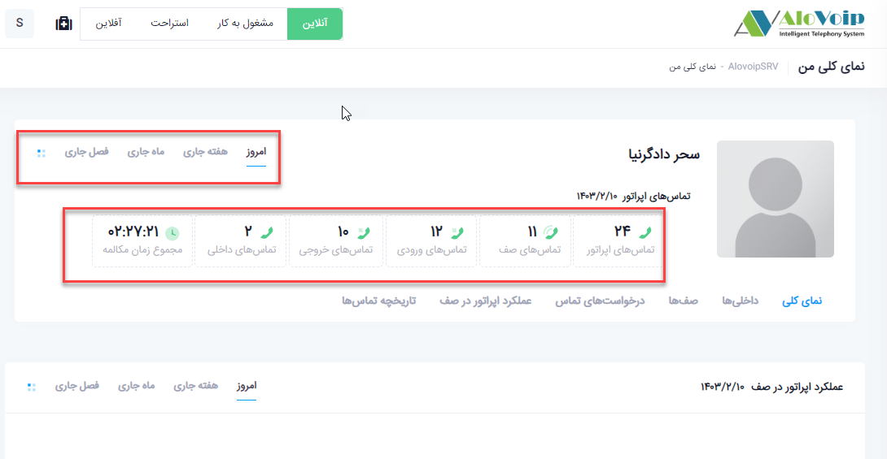
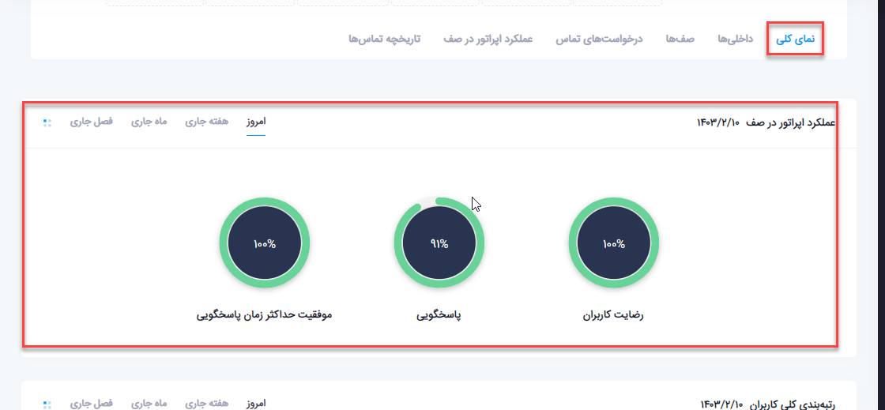
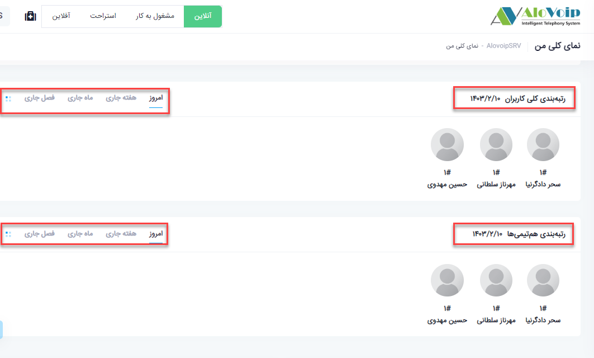
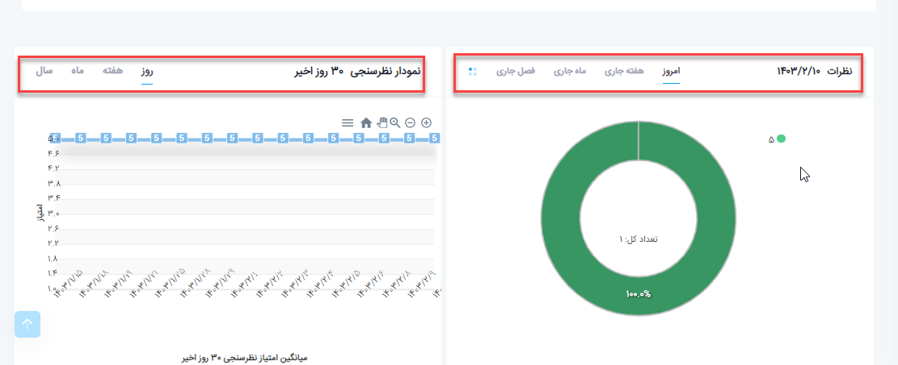
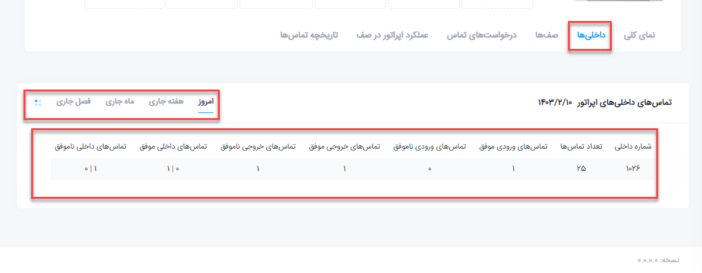
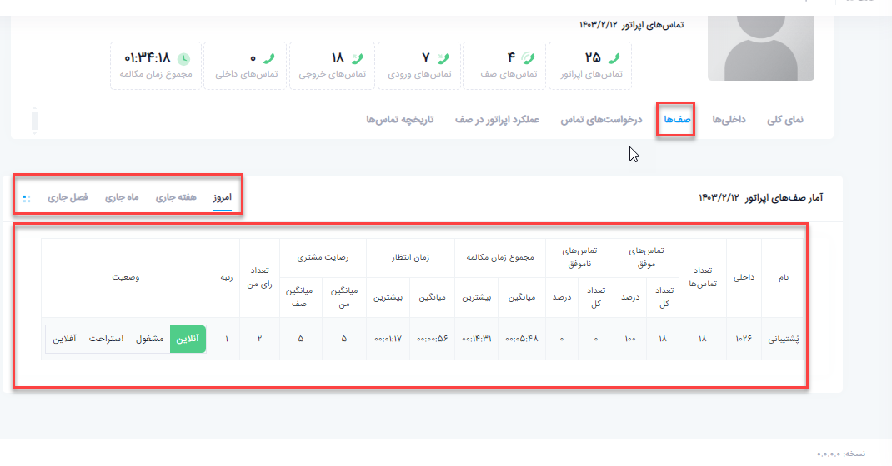
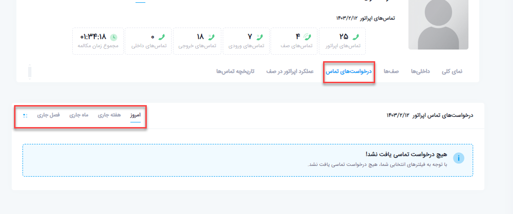
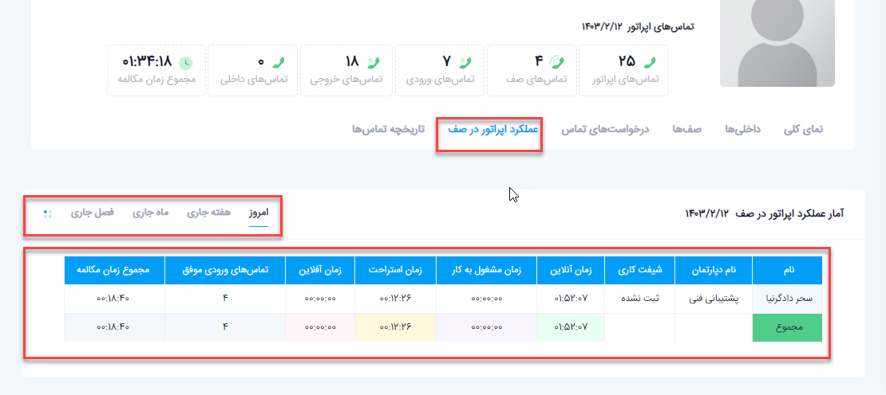
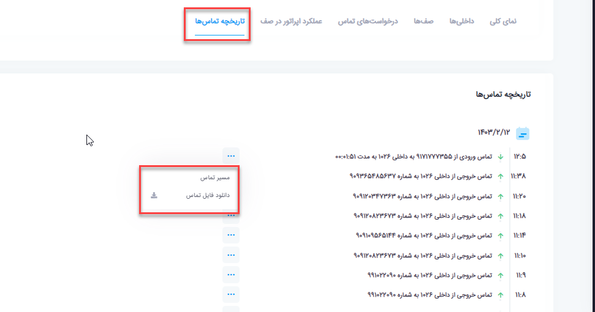

## نمای کلی من

در این بخش به موضوعات زیر می‌پردازیم:

• 	[هدف از نمای کلی من](#PurposeOfMyOverview)

• 	[نمای کلی من](#MyOverview)

• 	[ نمای کلی](#Overview)

• 	[داخلی ها ](#Extentions)

• 	[صف ها ](#Queues)

•   [درخواست های تماس](#ContactRequests)

•	[عملکرد اپراتور در صف ](QueuingOperatorPerformance)

•	[تاریخچه تماس ها ](#CallHistory)

## هدف از نمای کلی من{#PurposeOfMyOverview}
بطور کلی هر اپراتور در نمای کلی من می‌تواند عملکردخود، نظرسنجی و تاریخچه تماس هایش را مشاهده کند.
## نمای کلی من{#MyOverview}
وقتی شما به عنوان اپراتور ساده وارد پنل کاربری خود می‌شوید با صفحه زیر روبه رو می‌شوید.با انتخاب سرور تلفنی وارد پنل کاربری خود می‌شوید.

در بخش اول کاربر می‌تواند اطلاعات تماسی خود را که شامل تماس های صف، ورودی، خروجی، داخلی به داخلی است مشاهده کند. این اطلاعات بر اساس فیلتر امروز، هفته جاری و... تغییر می‌کند

## نمای کلی{#Overview}
در این بخش کاربر می‌تواند عملکرد خودش را در صف مشاهده کند. این بخش هم قابل فیلتر است.

•	رتبه بندی کلی کاربران

این بخش رتبه کاربر را در کل سازمان نشان می‌دهد.اگر سازمانتان نظرسنجی های مختلفی داشته باشد در این قسمت می‌توانید رتبه خود را مشاهده کنید و بر اساس تاریخی که می‌خواهید آن را فیلتر کنید.

•	رتبه بندی هم تیمی ها

همچنین می‌توانید رتبه خودتان را در تیم یا دپارتمان خود مشاهده کنید.این بخش هم قابلیت فیلتر دارد.

•	نظرات

در این قسمت می‌توانید بصورت نموداری نظراتی که به شما داده شده است را مشاهده کنید.با کلیک بر روی نمودار متوجه می‌شوید چه سازمانی به شما رای داده است .ویس مربوط به آن را هم  می‌توانید گوش دهید یا دانلود کنید.

•	نمودار نظرسنجی سی روز اخیر

در این قسمت با فیلتر مورد نظر نتایج را بصورت نموداری مشاهده می‌کنید.

## داخلی ها{#Extentions}

در بخش داخلی ها، داخلی های مرتبط با کاربر را نشان می‌دهد و کاربر می‌تواند وضعیت تماس های خود را  بر اساس روز، هفته، ماه، فصل و تاریخ دلخواه مشاهده کند.بر اساس تاریخی که انتخاب می‌کنید می‌توانید مشاهده کنید چه داخلی هایی مرتبط با شما است و تعداد تماس های ورودی موفق و ناموفق، خروجی موفق و ناموفق و تعداد تماس های داخلی موفق و ناموفق چه تماس هایی که شروع کننده بودید و چه تماس هایی که دریافت کننده بودید را مشاهده کنید.

## صف ها{#Queues}

در این قسمت می‌توانید وضعیت تماسی خود را در صف هایی که قرار دارد مشاهده کنید. در واقع اپراتور می‌تواند مشاهده کند در چه صف هایی قرار گرفته است و وضعیت تماس هایش در هر صف به چه صورت است. به عنوان مثال  در تصویر زیر اپراتور در صف پشتیبانی قرار دارد و می‌تواند تماس های موفق و ناموفق،مجموع زمان مکالمه و انتظار و همچنین نتایج نظرسنجی مرتبط با خود را مشاهده کند.این اعداد براساس فیلتر روز، هفته، ماه،سال و .... قابل تغییر است.

## درخواست های تماس {#ContactRequests}
در این قسمت می‌توانید مشاهده کنید چه شماره هایی درخواست تماس خود را برای اپراتور مورد نظر ثبت کرده اند.درخواست تماس در واقع یک ماژولی در پنل الوویپ است که اگر یک داخلی پاسخگوی تماسی نباشد، تماس گیرنده می‌تواند یک درخواست تماس ثبت کند. اپراتور از پنل خودش شماره هایی که درخواست تماس ثبت کرده اند را می‌تواند مشاهده کند و در صورت تمایل با آن شماره ها تماس بگیرد.در این قسمت هم فیلتر بر اساس تاریخ مدنظر وجود دارد.

## عملکرد اپراتور در صف{#QueuingOperatorPerformance}

در این بخش اپراتور می‌تواند عملکرد خودش را در صف هایی که قرار دارد مشاهده کند. در واقع وقتی یک داخلی در یک صف قرار می‌گیرد چهار عمل را می‌تواند داشته باشد.خودش را می‌تواند در حالت های آنلاین، آفلاین، استراحت و یا مشغول بکار قرار دهد.همچنین می‌توانید مشاهده کنید اپراتور در چه مدت زمانی در صفی که قرار گرفته است آنلاین، آفلاین و... بوده است.این آمار بر اساس فیلتر زمانی شما تغییر می‌کند به عنوان مثال این اپراتور در تاریخ   فیلتر شده یک ساعت و پنجاه و دو دقیقه آنلاین و دوازده دقیقه در حال استراحت بوده است.

## تاریخچه تماس ها{#CallHistory}

در این قسمت اپراتور می‌تواند تمام تماس هایی که داشته است را شامل ورودی و خروجی مشاهده کند و حتی می‌تواند فایل ضبط شده خودش را بصورت مستقیم گوش دهد و یا آن را دانلود کند.برای این کار فقط کافی است روی علامت سه نقطه روبروی گزارش تماسی که می‌خواهد کلیک کند و گزینه دانلود فایل تماس را بزند.

