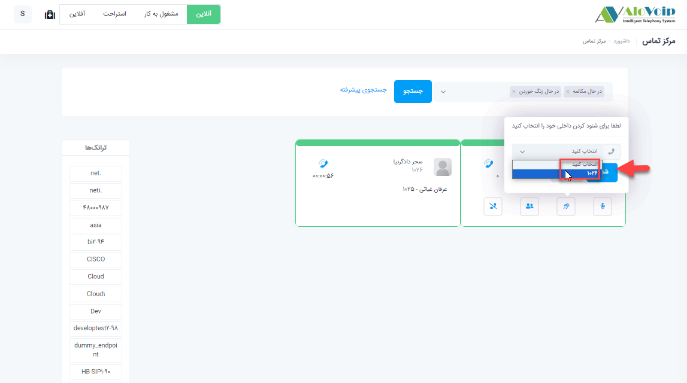
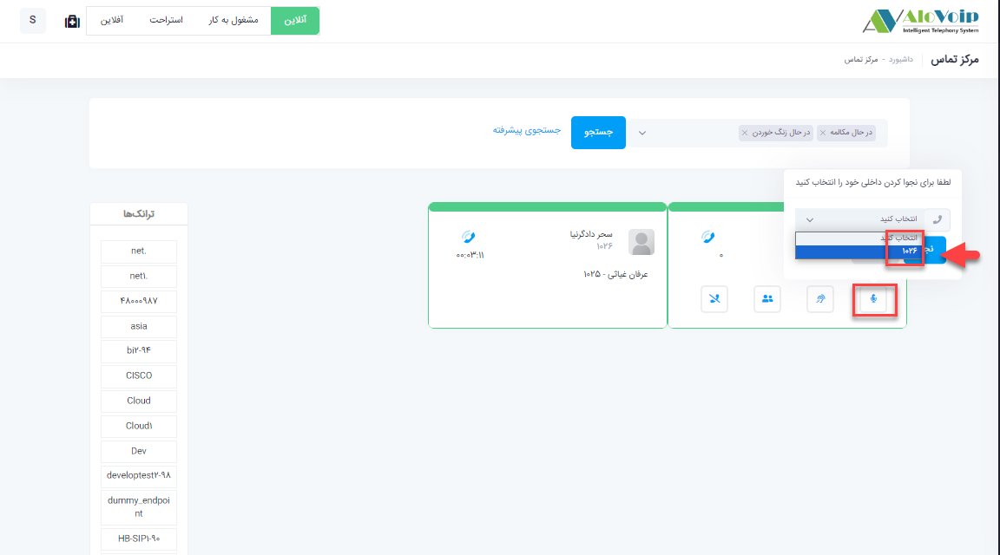

# شنود و نجوا
در این بخش به موضوعات زیر می‌پردازیم: 
•	[مقدمه ](#Introduction)

•   [شنود](#listening)

• [ نجوا  ](#Whisper)

## مقدمه{#Introduction}

در بخش مانیتورینگ مرکز تماس تمام داخلی های سازمان را می‌توانید مشاهده کنید و از وضعیت آنها که چه داخلی هایی آزاد و یا در حال مکالمه هستند مطلع شوید.همچنین این امکان برای مدیران دپارتمان ها فراهم می‌شود که بتوانند داخلی های مربوط به دپارتمان خود را شنود، نجوا کنند.
## شنود{#listening}

با قرار دادن نشانگر موس بر روی داخلی در حال مکالمه گزینه های شنود ، نجوا، کنفرانس و قطع تماس برای مدیر دپارتمان فراهم می‌شود.برای این کار به عنوان مثال کافی است روی علامت شنود کلیک کرده و از پنجره باز شده داخلی خود را انتخاب  و روی گزینه شنود کلیک کنید.در این حالت یک تماس به سمت داخلی انتخاب شده می‌رود، داخلی زنگ می‌خورد و با برداشتن گوشی روی خط اپراتور می‌روید و امکان شنیدن مکالمات کارشناس خود را با تماس گیرنده دارید و هیچکدام از طرفین متوجه این شنود نمی‌شوند.

## نجوا{#Whisper}

در حالت نجوا شما می توانید با کار شناس خود صحبت کنید.مانند حالت شنود روی دکمه نجوا کلیک کرده و داخلی خود را انتخاب و مجدد نجوا را می‌زنید

