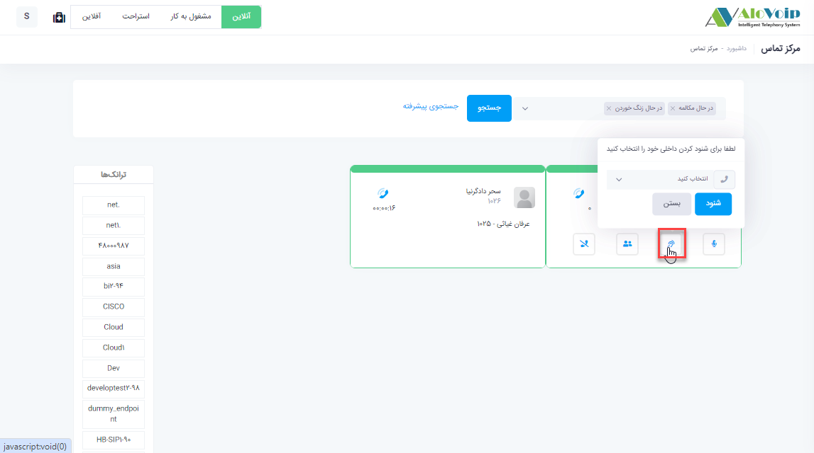

# شنود و نجوا
در این بخش به موضوعات زیر می‌پردازیم: 
- [مقدمه ](#Introduction)
- [شنود](#listening)
- [ نجوا  ](#Whisper)

## مقدمه{#Introduction}
در بخش مانیتورینگ مرکز تماس، تمامی داخلی‌های سازمان قابل مشاهده هستند و می‌توان از وضعیت آن‌ها ــ اعم از آزاد بودن یا در حال مکالمه بودن ــ اطلاع یافت. این بخش به مدیران دپارتمان‌ها این امکان را می‌دهد تا داخلی‌های مربوط به مجموعه‌ی خود را شنود یا نجوا کنند و از روند گفت‌وگوی کارشناسان با تماس‌گیرندگان آگاه شوند.

## شنود{#listening}
برای استفاده از قابلیت شنود، کافی است نشانگر موس را بر روی داخلیِ در حال مکالمه قرار دهید. در این حالت، گزینه‌های **شنود،** **نجوا،** **کنفرانس** و **قطع** **تماس** برای مدیر دپارتمان نمایش داده می‌شود.
به‌عنوان مثال، با انتخاب گزینه‌ی **شنود،** پنجره‌ای باز می‌شود که در آن باید داخلی خود را تعیین کنید و سپس بر روی دکمه‌ی شنود کلیک نمایید. در این مرحله یک تماس از سمت سیستم به سوی داخلی انتخاب‌شده برقرار می‌شود؛ پس از پاسخ‌گویی، مدیر وارد خط ارتباطی می‌گردد و می‌تواند **مکالمه‌ی کارشناس با تماس‌گیرنده را بی‌صدا و بدون اطلاع طرفین گوش دهد**. این ویژگی برای ارزیابی کیفیت پاسخ‌گویی و آموزش کارشناسان بسیار مؤثر است.

## نجوا{#Whisper}
در حالت نجوا، مدیر دپارتمان می‌تواند بدون اینکه تماس‌گیرنده متوجه شود، با کارشناس خود صحبت کند و راهنمایی‌های لازم را در لحظه ارائه دهد. مشابه با حالت شنود، کافی است بر روی گزینه‌ی نجوا کلیک کرده، داخلی خود را انتخاب و مجدداً دکمه‌ی نجوا را بفشارید. بدین ترتیب، ارتباطی دوطرفه میان مدیر و کارشناس برقرار می‌شود، در حالی که تماس اصلی بدون اختلال ادامه خواهد داشت.

