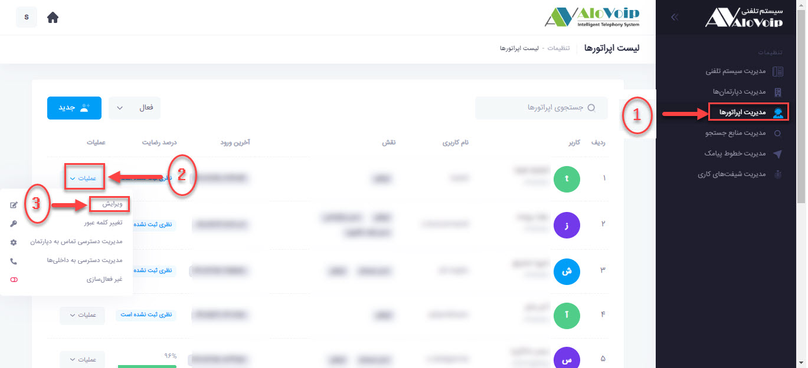
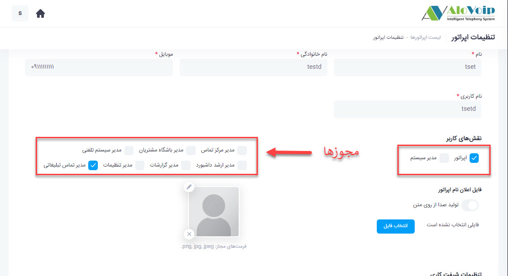
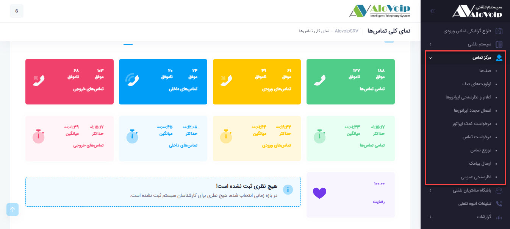
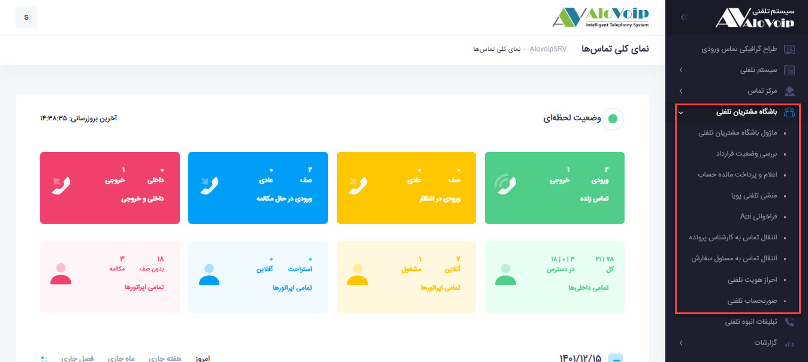
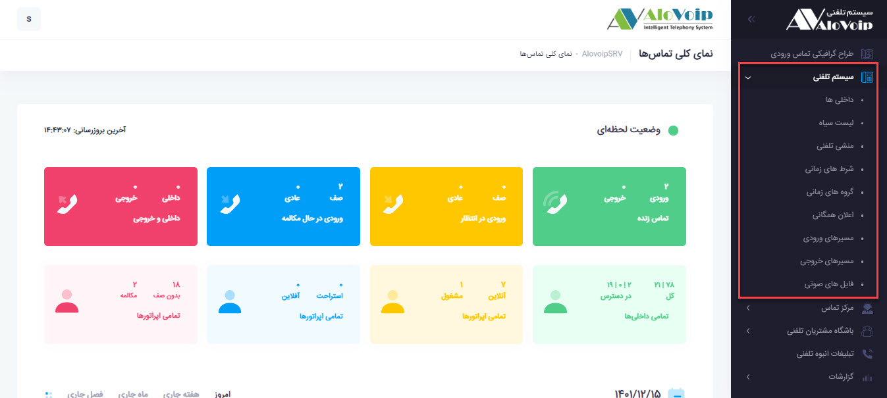
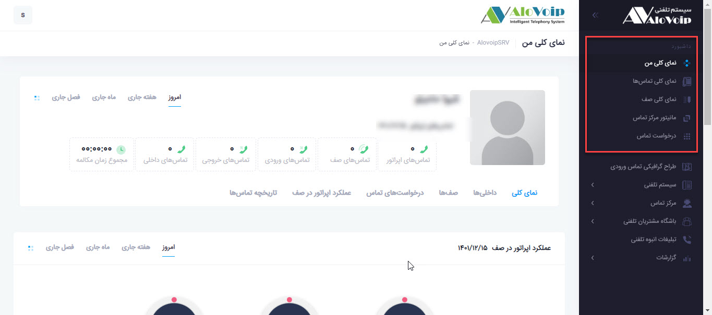
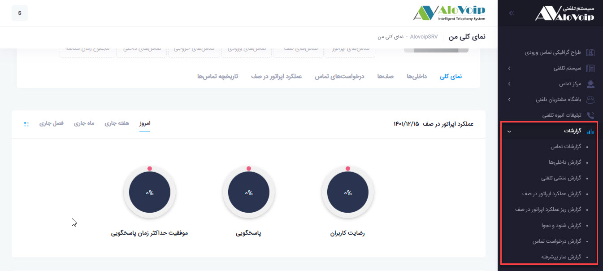
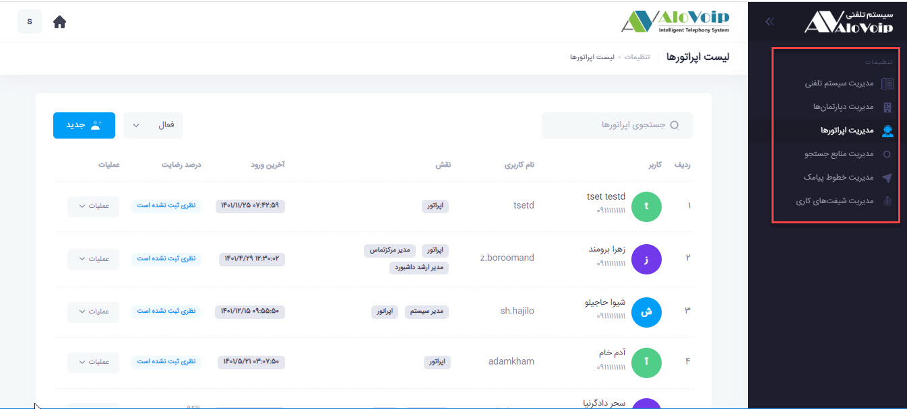
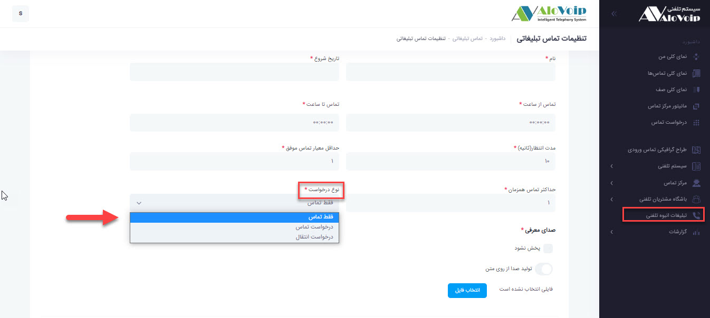

# نحوه تعریف دسترسی مجوز به هر اپراتور
برای تعریف دسترسی های هر اپراتور پس از **ساخت اپراتور جدید** در صفحه ورود به پنل بر روی علامت تنظیمات در قسمت بالای صفحه گوشه سمت چپ کلیک می کنیم. 
<!--- link ایجاد یک اپراتور جدید --->

در صفحه باز شده بر روی مدیریت اپراتورها کلیک میکنیم  و میتوانیم اپراتور مورد نظر خود را با استفاده از فیلتر جستجوی اپراتورها پیدا کنیم و سپس گزینه عملیات را نتخاب کرده و بر روی ویرایش کلیک میکنیم. 

در صفحه باز شده در قسمت نقش های کاربر میتوانید دسترسی ها را تعریف کنید. 
نکته قابل توجه این است که اگر در این قسمت تیک مدیر سیستم را فعال کنید بطور اتوماتیک به تمامی این مجوزها دسترسی خواهد داشت.
اگر در این قسمت تیک اپراتور را انتخاب کنیم به دلخواه می توانیم هر مجوزی که لازم می باشد به اپراتور مورد نظرمان اختصاص دهیم.

1. **مدیر مرکز تماس** 
در صورت انتخاب این مجوز دسترسی های اپراتور شامل موارد ذیل می باشد.

2.   **مدیر باشگاه مشتریان**  
در صورت انتخاب این مجوز دسترسی های اپراتور شامل موارد ذیل می باشد.

3. **مدیر سیستم تلفنی** 
در صورت انتخاب این مجوز دسترسی های اپراتور شامل موارد ذیل می باشد.

4. **مدیر ارشد داشبور** 
در صورت انتخاب این مجوز دسترسی های اپراتور شامل موارد ذیل می باشد.

5. **مدیر گزارشات**
در صورت انتخاب این مجوز دسترسی های اپراتور شامل موارد ذیل می باشد.

6. **مدیریت تنظیمات** 
برای دسترسی به این صفحه از مرحله عکس اول پیش می رویم و با کلیک بر روی علامت تنظیمات در قسمت بالا گوشه سمت چپ وارد آن می شویم.

7. **مدیر تماس تبلیغاتی**
با دسترسی به این مجوز شما می توانید بصورت تلفنی با شماره های انبوه تماس گرفته و متن مورد نظر خود را بصورت صدا برای آنها پخش کنید و  در صفحه تنظیمات این مجوز فیلد های ذیل را کامل کنید.
در ابتدا یک نام برای تماس تبلیغاتی خود انتخاب میکنیم و تاریخ تماس را نیز وارد میکنیم زمان شروع و پایان را مشخص میکنیم و فیلد مدت زمان انتظار برای زمان برقراری تماس است که چند ثانیه بعد از برقراری تماس تبلیغات پخش شود. 
حداقل معیار تماس موفق تعیین میکند که از میان شماره هایی که در نظر گرفتید حداقل چه تعداد از تماس ها موفق باشد. 
فیلد حداکثر تماس همزمان نیز تعداد تماس هایی که باهم برقرار شود  را مشخص میکند. 
نکته مهم در فیلد نوع درخواست می باشد:
1. **فقط تماس**: به این صورت است که تماس برقرار شده و تبلیغات پخش می شود. 
2. **درخواست تماس**: پس از پایان تبلیغات مشترک شماره خود را وارد می کند و شما با وی تماس میگیرید. 
3. **درخواست انتقال** : پس از پخش تبلیغات تماس به یک IVR و یا صف و یا اپراتور مورد نظر شما وصل می شود. 
در فیلد صدای معرفی شما می توانید یک متن را وارد کرده و همان متن در هنگام تماس پخش شود و یا یک فایل ضبط شده با فرمت مناسب آپلود کنید و در پایان کلید ثبت را فشار دهید

