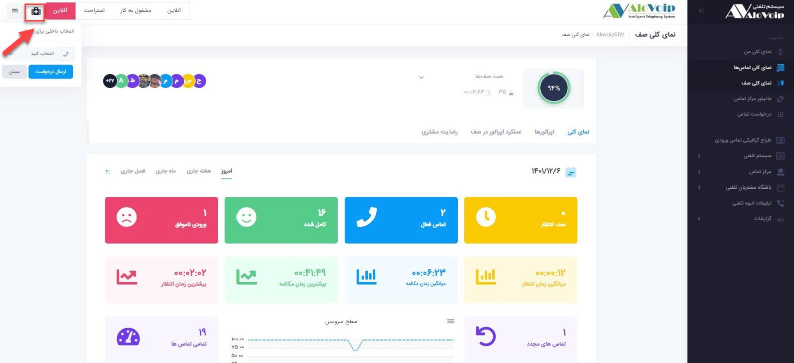

# نحوه استفاده از ماژول درخواست کمک اپراتور
این ماژول جهت کمک به اپراتورهای تازه کار و جهت رفع هرچه سریعتر مشکل مشتری می باشد.
نحوه کار این ماژول به این صورت می باشد که 
زمانی که اپراتور نیاز به کمک از طرف مدیر خود دارد وارد پنل خود شده و در قسمت بالا سمت چپ روی گزینه ***درخواست کمک*** کلیک میکند و یک تماس به سمت مدیر آن واحد ارسال می شود و مدیر با پاسخگویی به اپراتور خود به او در رفع مشکل کمک میکند.
  

 