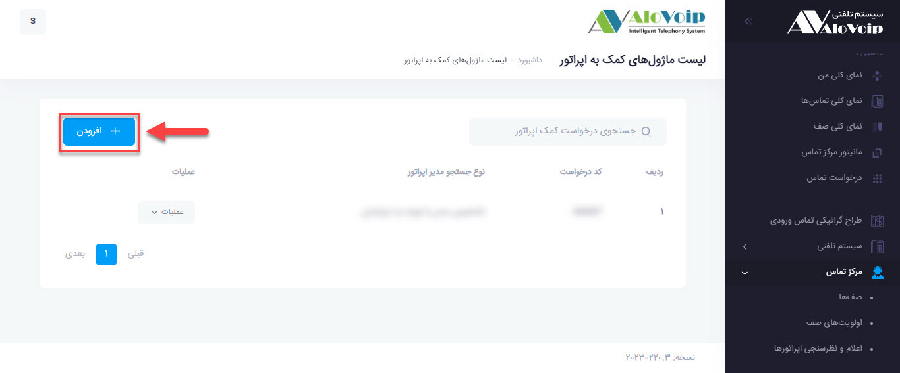

# تنظیمات ماژول کمک اپراتور
برای تنظیمات ماژول [کمک اپراتور]() مراحل زیر را انجام می دهیم.
<!--- link -->
1. وارد پنل الوویپ شده و در قسمت **مرکز تماس** گزینه **درخواست کمک اپراتور** را انتخاب میکنیم.

2. در صفحه باز شده بر روی دکمه  افزودن کلیک میکنیم و به صفحه تنظیمات ماژول کمک به اپراتور وارد می شویم.

3. در این قسمت مانند تصویر در قسمت کد درخواست یک کد دلخواه با * وارد میکنیم بهتر است این کد بصورت 3 یا 4 رقمی باشد.
4. برای فیلد نوع تشخیص مدیر 2 حالت موجود است که اگر گزینه تشخیص مدیر از طریق منبع جستجو را انتخاب کنیم مدیر آن واحد از طریق نرم افزار CRM شناسایی می شود و اگر تشخیص مدیر با توجه به دپارتمان را انتخاب کنیم باید در قسمت دپارتمان ها مدیر انتخاب شود.
5.  قسمت صدای ارسال درخواست اگر فعال شود در صورتی که اپراتور روی دکمه درخواست کمک کلیک کند متنی که می نویسیم بطور مثال:(درخواست کمک به اپراتور ارسال شد) پخش می شود.
6.  قسمت صدای در دسترس نبودن مدیر اگر فعال شود متنی که می نوسیم بطور مثال:(مدیر مربوطه در دسترس نمی باشد) برای اپراتور پخش می شود.
7. در انتها دکمه ثبت را زده و تنظیمات این ماژول پایان می پذیرد. 

