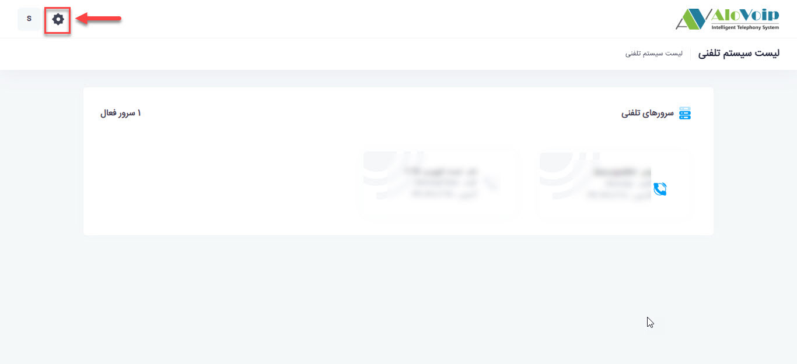
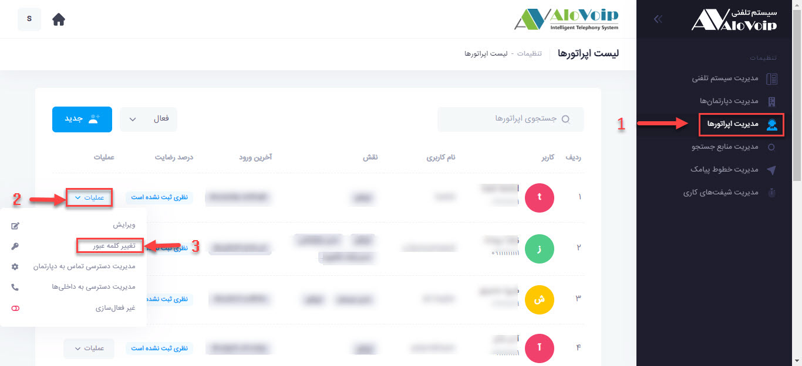

# نحوه تغییر پسورد اپراتور توسط ادمین
زمانی که شما به عنوان ادمین قصد تغییر پسورد اپراتور را 
دارید باید مراحل زیر انجام شود. 
ابتدا وارد پنل شوید و سپس روی علامت **تنظیمات** در گوشه بالا سمت چپ کلیک میکنید. 

در صفحه باز شده در سمت راست بر روی **مدیریت اپراتورها** کلیک کنید سپس اپراتور مورد نظری که قصد تغییر پسورد آن را دارید را جستجو کرده و گزینه **عملیات** را انتخاب کنید و بعد از بر روی گزینه **تغییر کلمه عبور** کلیک کنید. 

در صفحه باز شده رمز جدید را وارد کرده و بر روی دکمه ثبت کلیک نمایید.