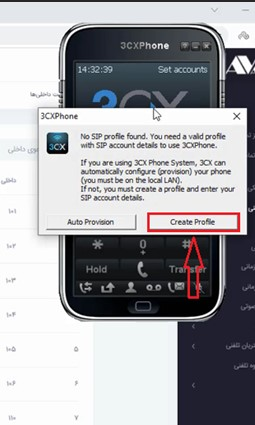
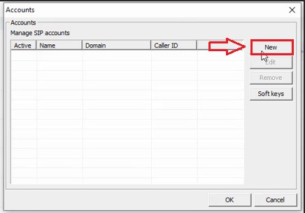
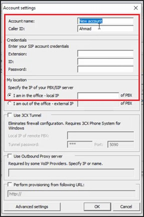
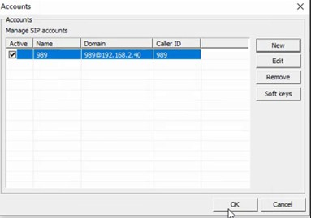
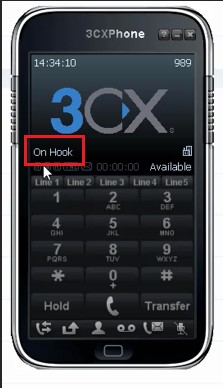

# تنظیم داخلی بر روی 3CX 

در این بخش به موضوعات زیر می‌پردازیم:

•	[هدف از رجیستر کردن داخلی بر روی نرم افزار3cx](#ThePurposeOInternalRegistrationOnThe3cxSoftware)

•	[تنظیم داخلی بر روی 3CX](#ExtentionSetupOn3CX)

## هدف از رجیستر کردن داخلی بر روی نرم افزار3cx{#ThePurposeOInternalRegistrationOnThe3cxSoftware}

به منظور زنگ خوردن تلفن بر روی سیستم کامپیوتری می‌توانید از نرم افزار 3cx استفاده کنید.این نرم افزار می‌تواند جایگزین خوبی برای Ip Phone ها باشد.

## تنظیم داخلی بر روی 3CX{#ExtentionSetupOn3CX}

بعد از نصب نرم افزار و باز کردن آن برای بار اول با صفحه زیر رو به رو می شوید که از شما می خواهد حتما داخلی مدنظر خود را برایش رجیستر کنید. برای این کار ابتدا روی **گزینه create profile ** مطابق تصویر زیر بزنید.

در ادامه پنجره جدیدی برای شما باز می شود که باید **گزینه  **new را انتخاب کنید.

با زدن **گزینه **new باز هم پنجره جدیدی مطابق تصویر زیر برای شما باز می شود.

•	در بخش **Account name**شماره داخلی مورد نظر را وارد کنید. 

•	در بخش **Caller ID**  شماره داخلی مورد نظر خود را وارد کنید. 

•	در بخش  **Extension** شماره داخلی و در بخش **ID** هم شماره داخلی را وارد کنید.

•	در قسمت **Password** هم باید رمزی که زمان ساخت داخلی در پنل وارد کردید را در این قسمت وارد کنید. 

•	در بخش **Local IP** , آی پی سیستم تلفنی خود را وارد کنید.

**نکته مهم** 
 >نباید آی پی پنل الوویپ را وارد کنید. باید آی پی سیستم تلفنی خود که از نوع elastix و issabel و یا هر نوع سیستم تلفنی دیگری است را وارد کنید و در نهایت ok را بزنید.

در ادامه تصویر زیر برای شما نشان داده می شود که داخلی شما ست شده است.

روی گزینه ok کلیک کنید. زمانی که داخلی شما رجیستر شود در صفحه نرم افزار باید گزینه On Hook**  **را همانند تصویر زیر ببینید.

