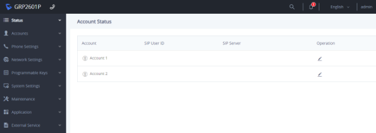

# راه اندازی داخلی روی آی پی فون گرند استریم

در این بخش به موضوعات زیر می‌پردازیم:

• هدف از رجیستر کردن داخلی بر روی آی پی فون گرند استریم

• ورود به صفحه آی پی فون گرند استریم

• راه اندازی داخلی روی تلفن گرند استریم

• تنظیمات داخلی روی تلفن گرند استریم

## هدف از رجیستر کردن داخلی بر روی آی پی فون گرند استریم**

به منظور داشتن تماس ورودی و خروجی در سیستم تلفنی خود نیاز به رجیستر کردن داخلی بر روی آی پی فون دارید.

## ورود به صفحه ای پی فون گرند استریم**

برای ورودی به صفحه وب آی پی فون کافی است آی پی که تلفن گرفته است را در مرورگر خود وارد کنید.پس از وارد کردن با صفحه زیر مواجه می‌شوید . 

با وارد کردن یوزرنیم و پسورد که هر دو به صورت پیش فرض کلمه admin هستند و فشردن گزینه Login وارد صفحه وب دستگاه تلفن گرند استریم خواهید شد.

آی پی فون گرند استریم GRP2601P ، دو اکانت دارد .برای رجیستر کردن داخلی بر روی اکانت اول بصورت زیر تنظیمات را انجام ‌دهید.

## راه اندازی داخلی روی تلفن گرنداستریم**

برای راه اندازی داخلی ها روی آی پی فون گرند استریم، ابتدا از منوی سمت چپ، روی گزینه \*\***Account**\*\* کلیک کرده و سپس\*\***Accounts**\*\* را انتخاب کنید.

در فرمی که نمایش داده شده است باید تنظیمات زیر را انجام دهید.

• گزینه\*\* **Account Active\*\*** را انتخاب کنید تا تلفن فعال شود.

• در قسمت \*\***Account name\*\*** می‌توانید از ترکیب اعداد و حروف استفاده کرده و نامی را به اکانت یا همین تلفن اختصاص دهید. یا می‌توانید همان  شماره داخلی مورد نظرتان که در ایزابل  ایجاد کرده اید وارد کنید مثلا 1024.

• در قسمت\*\* **SIP Server\*\***، باید IP اختصاص داده شده به سیستم تلفنی را وارد می کنید.
• Seceondry SIP Server برای این طراحی شده که اگر به هر دلیلی سرور اول از دسترس خارج شد، این سرور دوم جایگزین شود و دسترسی به تلفن قطع نشود. اگر سرور دومی داشتید می توانید در این قسمت IP آن را وارد کنید.

• در قسمت \*\***SIP User ID\*\*** و \*\***Authentication ID\*\*** شماره داخلی مورد نظرتان را وارد کنید .

• در قسمت \*\***Authentication password**\*\* نیز همان پسوردی که در سیستم تلفنی به داخلی 1024 اختصاص داده بودید را وارد کنید..

• برای فعال شدن این داخلی روی تلفن مورد نظر یا باید روی \*\***Save and Apply\*\*** کلیک کنید.

## تنظیمات داخلی روی تلفن گرند استریم**

برای مشاهده تنظیمات روی داخلی گرند استریم پس از فعال سازی از برگه \*\***Status\*\*** روی قسمت \*\***Account Status**\*\*کلیک کنید.

همانطور که مشاهده می‌کنید، در Account Status تمام اطلاعات لازم در خصوص داخلی ساخته شده را به شما نشان داده می‌شود.

