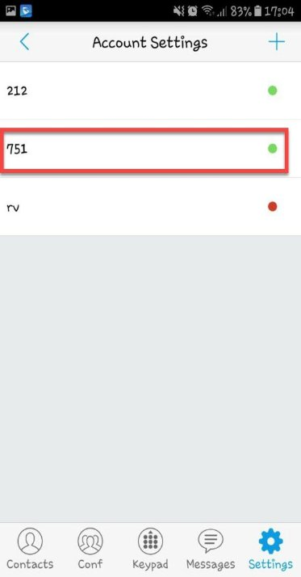

# تنظیمات نرم افزارGS Wave Lite بر روی موبایل

در این بخش به موضوعات زیر می‌پردازیم:

• [هدف از رجیستر کردن داخلی بر روی موبایل ](#ThePurposeOfInternalRegistrationOnMobile)  
• [تنظیم داخلی بر روی نرم افزار GS Wave Lite](#ExtentionSetuponGSWaveLiteSoftware)  

## هدف از رجیستر کردن داخلی بر روی موبایل{#ThePurposeOfInternalRegistrationOnMobile}

برای اینکه بتوانید تماس ورودی و خروجی بر روی موبایل خود داشته باشید باید داخلی بر روی موبایل رجیستر شود. نرم افزارهای مختلفی برای رجیستر داخلی بر روی موبایل وجود دارد که در این مقاله تنظیمات نرم افزار  Gswave lite  توضیح داده می‌شود.

## تنظیم داخلی بر روی نرم افزار GS Wave Lite{#ExtentionSetupon GSWaveLiteSoftware}

برای رجیستر کردن داخلی باید مراحل زیر را طی کنید. ابتدا نرم افزار Gswave lite  را دانلود کرده و بر روی گوشی خود نصب کنید.

• وارد نرم افزار شده و در قسمت \*\***Settings\*\*** گزینه \*\***Account Settings\*\*** را انتخاب کنید. 

• سپس گزینه \*\***Add\*\*** را که به شکل یک \*\***+\*\*** می باشد انتخاب کنید.

• در صفحه باز شده گزینه **SIP Account** را انتخاب ‌کنید.

• در این مرحله گزینه **Activate Account** را باید فعال کنید.

• قسمت های **Account Name\*\*** ، **SIP User ID**  ،  **SIP Authentication ID** ،  **Display Name  \*\*** را برابر شماره داخلی مثلا 750 قرار دهید. 

• در قسمت **SIP Server\*\*\*\***  آدرس سرور تلفنی را وارد کرده و **\*\*Password\*\***  را برابر پسورد داخلی خود قرار دهید و تیک بالای صفحه را جهت ذخیره تنظیمات بزنید. 

• باید چراغ  آن داخلی به رنگ سبز رنگ در بیاد.در این حالت داخلی بر روی موبایل رجیستر شده است. 

