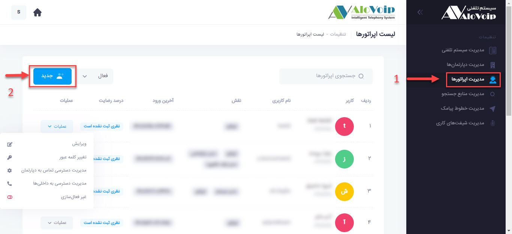
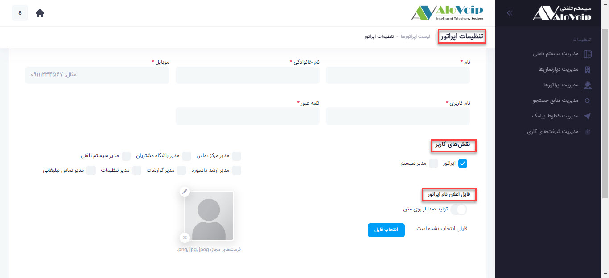
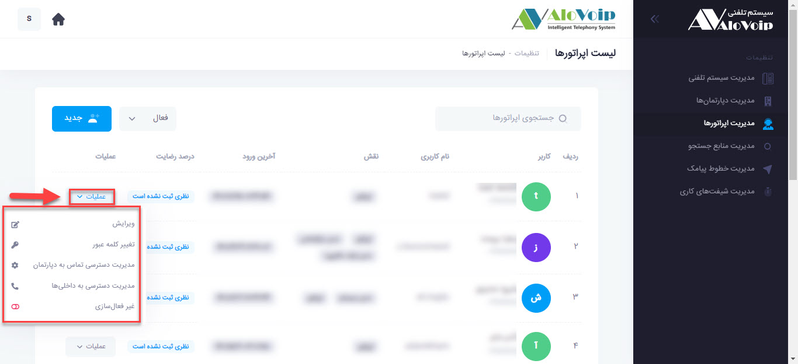
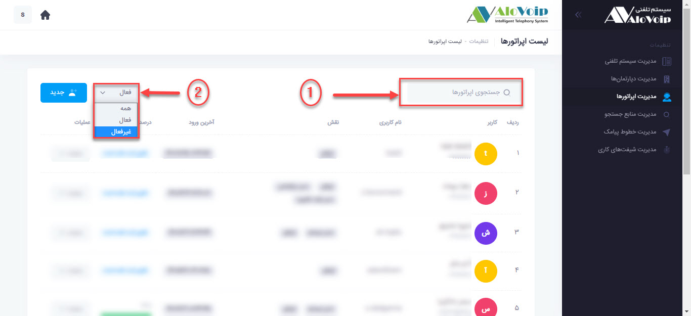

# ایجاد یک اپراتور جدید
برای ایجاد یک اپراتور جدید ابتدا در صفحه اصلی پنل بر روی علامت **تنظیمات** در گوشه بالا سمت چپ کلیک کنید.(نکته قابل توجه این است که این علامت تنظیمات فقط برای کسانی ظاهر می شود که **دسترسی مدیر سیستم** را دارند.) 
<!--- link --->

در صفحه باز شده بر رروی گزینه **مدیریت اپراتورها** کلیک کرده و سپس دکمه **جدید** را انتخاب کنید. 

در قسمت تنظیمات عمومی اطلاعات کاربر را وارد میکنیم و سپس  در قسمت نقش های کاربر ابتدا اپراتور یا مدیر سیستم بودن و سپس [نوع دسترسی کاربر]() را تعیین میکنیم.
نکته قابل توجه در این قسمت این است که اگر گزینه مدیرسیستم را انتخاب کنیم بطور اتوماتیک تمامی دسترسی های ذکر شده به اپراتور داده می شود. 
 <!--- link -->
 

همچنین با فعال کردن گزینه تولید صدا از روی متن میتوانید متن دلخواه خود را وارد کنید و زمانی که تماس به اپراتور  وصل شد متن وارد شده بصورت صدا پخش میشود.بطور مثال شماره داخلی یا نام و نام خانوادگی اپراتور.
 با بازگشت به صفحه **مدیریت اپراتورها** می توانید اپراتور ایجاد شده را مشاهده کنید حال شما می توانید با کلیک بر روی **گزینه عملیات** کارهای ذیل را انجام دهید. 

1. در قسمت **ویرایش** شما میتوانید اطلاعات وارد کرده را تغییر دهید.
2. در قسمت **تغییر کلمه عبور** می توانید پسورد اپراتور خود را تغییر دهید.
<!--- Link -->
3. **مدیریت دسترسی تماس به دپارتمان** 
در این بخش شما می توانید دپارتمان هایی که اپراتور باید در آن باشد و سطح دسترسی آن را مشخص کنید. 
نکته قابل توجه این است که اگر شما در هنگام ساخت اپراتور تیک مدیر سیستم را فعال کرده باشید اپراتور به همه این موارد  گفته شده دسترسی دارد.

4. **مدیریت دسترسی به داخلی ها**
<!--- link-->
در این قسمت داخلی های مورد نظری که قصد داریم به آن اپراتور تخصیص داده شود را انتخاب میکنیم. 
5. **غیرفعالسازی** 
به دلیل اینکه امکان حذف اپراتور موجود نمی باشد شما اگر بخواهید یک اپراتور را حذف کنید باید این گزینه فعال شود. 
نکته1: در صفحه لیست اپراتورها می توانید در قسمت جستجو  نام اپراتور مورد نظر را وارد کرده و عملیات جستجو را انجام دهید. 
نکته 2:شما میتوانید در صفحه لیست اپراتورها  از فیلتر **فعال** یا **غیر فعال** و یا **همه** استفاده کرده و اپراتورهای مورد نظر خود را مشاهده نمایید. 

